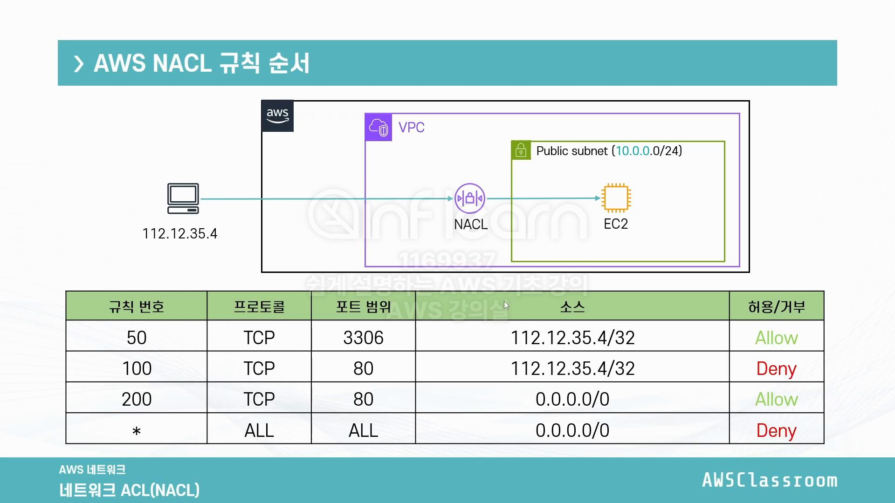

# 보안 그룹

* Network Access Control List(NACL)와 함께 방화벽의 역할을 하는 서비스
* Port 허용
    * 기본적으로 모든 포트는 비활성화
    * 선택적으로 트래픽이 지나갈 수 있는 Port와 Source를 설정 가능
    * Deny는 불가능 -> NACL로 가능함
* 인스턴스 단위(정확히는 ENI단위)
    * 하나의 인스턴스에 한 이상의 보안그룹 설정 가능
    * NACL의 경우 서브넷 단위

## Stateful

* 보안그룹은 Stateful
* Inbound로 들어온 트래픽이 별다른 Outbound 설정 없이 나갈 수 있음
* NACL은 Stateless

## 보안 그룹의 source
* IP Range(CIDR)
* 접두사 목록
* 다른 보안그룹(보안그룹 참조)
  * 활용
    * 외부에서 EC2에 직접 접근할 수 없게 할 때
    * Load Balancer의 IP는 계속 바뀌어서 보안 그룹을 IP로 설정할 수 없다
    * 그럴 때 Load Balancer의 보안그룹을 참조해서 EC2의 보안 그룹을 지정한다

### 접두사 목록
* 하나 이상의 CIDR 블록의 집합
* 보안 그룹 혹은 Route Table에서 많은 대상을 참조하기 위해 사용
* 두 가지 종류
  * 고객 관리형: 직접 IP주소를 생성/수정/삭제 할 수 있으며 다른 계정과도 공유 가능
  * AWS 관리형: AWS의 서비스들을 위한 IP목록. 수정, 삭제 업데이트 불가능
    * DynamoDB, S3, CloudFront
* IPv4, IPv6 둘다 사용 가능, 단 한 접두사 목록에 두 가지 타입을 동시에 사용 불가능
* 생성 시점에 최대 엔트리 숫자를 지정(이후 변경 가능)

# NACL(Network Access Control List)
* 보안 그룹처럼 방화벽 역할을 담당
* 서브넷 단위
  * 즉 인스턴스 단위로 제어 불가능
  * 다양한 서브넷에 연동 가능(1:N)
* 포트 및 아이피를 직접 Deny 가능
  * 외부 공격을 받는 상황 등 **특정 아이피를 블록**하고 싶을 때 사용
* Stateless
  * 들어오는 트래픽과 나가는 트래픽을 구분하지 않음
  * 즉 일반적으로 Outbound에 **Ephemeral Port(임시 포트) 범위를 열어주어야** 정상적으로 통신 가능

## NACL 규칙
* 규칙 번호: 규칙에 부여되는 고유 숫자이며 규칙이 평가되는 순서(낮은 번호부터)
  * AWS 추천은 100단위 증가
* 유형: 트래픽 유형(예: ssh=22, DNS=53, UDP=17 등)
* 프로토콜: 통신 프로토콜(예: TCP, UDP, SMP, ...)
* 포트 범위: 허용 혹은 거부할 포트 범위
* 소스: IP 주소의 CIDR 블록
* 허용/거부: 허용 혹은 거부 여부

## NACL 고려할 점
* Stateless 방화벽이기 때문에 원활한 통신을 위해서는 Outbound도 신경을 써야함
  * 임시포트 Allow!
  * Linux: 32768~61000
  * Windows: 1025-5000(XP), 49152~65535(Vista 이상부터)
* 서브넷에서 나가거나 들어오는 트래픽에만 적용
  * 즉 서브넷 내부의 트래픽에 대해서는 적용되지 않음
* 다양한 서브넷으로 구성되어있는 멀티 티어 아키텍처라면 더 많은 고민이 필요함
  * ex) EC2와 Database간의 통신일때 EC2가 Ephemeral Port를 사용하기 때문에 이 Port까지 고려해서 열어둬야 함
  * 따라서 **가능한 보안그룹**으로 먼저 처리 후 꼭 필요할 때 NACL 활용
* VPC 생성시, 혹은 AWS 계정 생성시 주어지는 VPC에 기본 하나 제공
  * 모든 트래픽 Allow
  * 단 직접 생성하는 NACL의 경우 모든 트래픽 Deny
* 하나의 서브넷은 하나의 NACL만 연동 가능, 단 하나의 NACL은 여러 서브넷에 연동 가능
