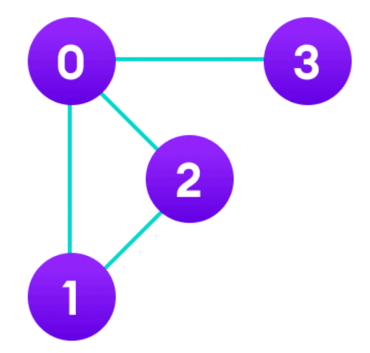

# 인접행렬(Adjacency matrix)

* 컴퓨터에게 내가 이러한 그래프를 그렸다고 알려주는 표현방법(인접 행렬, 인접 리스트)
* 인접해있다 = 연결되어있다
* 그래프에서 정점과 간선의 관계를 나타내는 bool 타입의 정사각형 행렬
    * 정사각형 행렬의 각 요소가 0 또는 1이라는 값을 가짐
    * 0은 두 정점 사이의 경로가 없음을 의미
    * 1은 두 정점 사이의 경로가 있음을 의미



|   | 0 | 1 | 2 | 3 |
|---|---|---|---|---|
| 0 | 0 | 1 | 1 | 1 |
| 1 | 1 | 0 | 1 | 0 |
| 2 | 1 | 1 | 0 | 0 |
| 3 | 1 | 0 | 0 | 0 |

* 위 표를 코드로 표현하면

```java
boolean[][] a = new boolean[][]{
        {false, true, true, true},
        {true, false, true, false},
        {true, true, false, false},
        {true, false, false, false}
};
```

* 이를 기반으로 코드를 구축하는 방법은
* 보통 이중 for문을 통해 i에서 j로 가는 경로가 있다면 어떠한 로직 또는 해당 정점으로부터 탐색하는 로직을 구축함

```java
public static void main(String[] args) {
    boolean[][] a = new boolean[V][V];
    for (int i = 0; i < V; i++) {
        for (int j = 0; j < V; j++) {
            if (a[i][j]) {
                // 출력하는 로직
                System.out.println(i + "부터 " + j + "까지 경로가 있습니다.");
            }
        }
    }
}
```

## Q. 3번 노드에서 5번 노드로 가는 단방향 경로가 있고 이를 인접 행렬로 표현한다면 어떻게 될까?

* a[3][5] = true;

## Q. 3번 노드에서 5번 노드로 가는 양방향 경로가 있고 이를 인접 행렬로 표현한다면 어떻게 될까?

* a[3][5] = true;
* a[5][3] = true;

## Q. 정점의 갯수가 20개인 그래프가 있다. 이를 인접행렬로 표현한다고 해씅ㄹ 때 메모리를 최소로 쓴다고 하면 배열을 어떻게 만들어야 할까?

* boolean[][] a = new boolean[20][20];

## Q. 인접 행렬을 기반으로 탐색하기

### 1번

* 정점은 0번부터 9번까지 10개의 노드가 있다. 1 - 2 / 1 - 3 / 3 - 4 라는 경로가 있다. 이를 인접행렬로 표현한다면?

```java
public static void main(String[] args) {
    boolean[][] a = new boolean[10][10];
    a[1][2] = true;
    a[1][3] = true;
    a[3][4] = true;
    a[2][1] = true;
    a[3][1] = true;
    a[4][3] = true;
}
```

### 2번

* 0번부터 방문 안한 노드를 찾고 해당 노드부터 방문, 연결된 노드를 이어서 방문해서 출력하는 재귀함수를 만들고 싶다면 어떻게 해야할까? 또한, 정점을 방문하고 다시 방문하지 않게 만들려면 어떻게 해야할까?
```java
static final int V = 10;
static boolean[][] a = new boolean[V][V];
static boolean[][] visited = new boolean[V];

static void go(int from) {
    visited[from] = true;
    System.out.println(from);

    for (int i = 0; i < V; i++) {
        if (visited[i]) continue;
        if (a[from][i]) {
            go(i);
        }
    }
}

public static void main(String[] args) {
    a[1][2] = true;
    a[1][3] = true;
    a[3][4] = true;
    a[2][1] = true;
    a[3][1] = true;
    a[4][3] = true;

    for (int i = 0; i < V; i++) {
        for (int j = 0; j < V; j++) {
            if (a[i][j] && visited[i]) {
                go(i);
            }
        }
    }
}
```