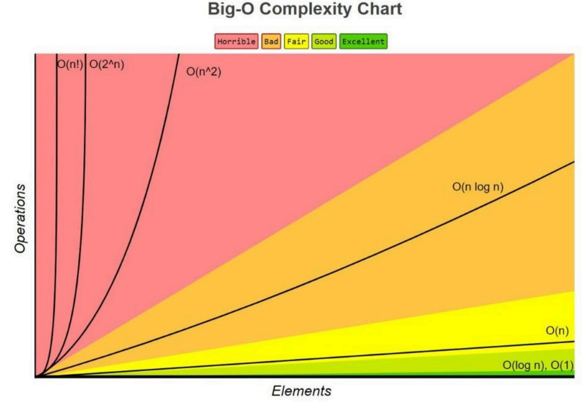

# 1. 개념

* 시간복잡도란 **입력 크기에 대해 어떠한 알고리즘이 실행되는데 걸리는 시간**
* 주요 로직의 반복 횟수를 중점으로 측정

# 2. 빅오 표기법(Big - O notation)

## 빅오 표기법 차트



* n! > 2^n > n^2 > nlog n > n > log n > 1

## 상수시간 시간복잡도 O(1)

* 입력 크기와 상관없이 일정한 시간복잡도를 가지는 것
* O(1)
* 입출력
* 곱하기, 나누기, 나머지 연산, 빼기 등
* 간단한 비교 if문
* 배열의 인덱스 참조

### 시간 복잡도 문제 1

```java
import java.util.Scanner;

public class Main {
    public static void main(String[] args) {
        Scanner scanner = new Scanner(System.in);
        int n = scanner.nextInt();
        int a = 0;

        for (int i = 0; i < n; i++) {
            for (int j = 0; j < i; j++) {
                a += i + j;
            }
        }

        System.out.println(a);
        scanner.close();
    }
}
```

* 답: O(n^2)

### 시간 복잡도 문제 2

```java
import java.util.Scanner;

public class Main {
    static int N, M;

    public static void solve(int N, int M) {
        int a = 1;
        for (int i = 1; i < N; i++) {
            a *= i;
        }
        for (int j = 1; j < M; j++) {
            a *= j;
        }
        System.out.println(a);
    }

    public static void main(String[] args) {
        Scanner scanner = new Scanner(System.in);
        N = scanner.nextInt();
        M = scanner.nextInt();
        solve(N, M);
        scanner.close();
    }
}
```

* 답: O(N + M)

### 시간 복잡도 문제 3
```java
public class Main {
    static int n;
    static int[] a;
}
```

# 3. 시간 복잡도가 필요한 이유
* 효율적인 코드로 개선하는데 쓰이는 기준이 되기 때문