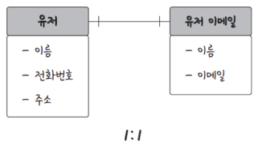
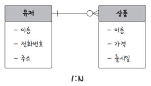
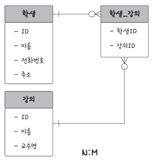
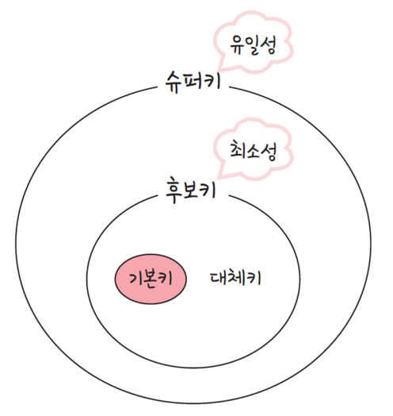

# 목차

1. [엔터티, 릴레이션, 속성, 도메인](#1-엔터디-릴레이션-속성-도메인)

    - [엔터티](#엔터디)
    - [릴레이션](#릴레이션)
    - [속성과 도메인](#속성과-도메인)

2. [필드, 레코드, 타입](#2-1-필드-레코드-타입)

    - [필드와 레코드](#필드와-레코드)
    - [타입](#타입)

3. [CHAR와 VARCHAR의 차이](#2-2-char와-varchar의-차이)

    - [CHAR](#char)
    - [VARCHAR](#varchar)

4. [TEXT와 BLOB](#2-3-text와-blob)

    - [TEXT](#text)
    - [BLOB](#이진데이터-blob)

5. [ENUM과 SET](#2-4-enum과-set)

    - [ENUM](#enum)
    - [SET](#set)

6. [관계와 키](#3-관계와-키)

    - [관계](#관계)
    - [키](#키)

7. [조인](#4-조인)

    - [내부 조인](#내부-조인inner-join)
    - [외부 조인](#외부-조인outer-join)

8. [교차 조인과 자연 조인](#5-교차-조인과-자연-조인)

    - [교차 조인](#교차-조인)
    - [자연 조인](#자연-조인)

9. [조인 알고리즘](#6-조인-알고리즘)

    - [중첩 루프 조인](#1-중첩-루프-조인)
    - [정렬 병합 조인](#2-정렬-병합-조인)
    - [해시 조인](#3-해시-조인)

# 1. 엔터디, 릴레이션, 속성, 도메인

## 엔터디

* 사람, 장소, 물건, 개념 등 여러 개의 속성을 지닌 명사이자 데이터베이스에서 실제 세계의 객체나 개념을 모델링한 것을 의미하며 DB 내에서 하나의 고유하게 식별될 수 있는 속성

### 약한 엔터티와 강한 엔터티

* Weak Entity: 독립적으로 존재할 수 없고 다른 강한 엔터티에 의존하는 엔터티. 보통 자체적인 주요 키를 가지지 않으며, 관련 강한 엔터티의 키를 참조함
* Strong Entity: 자체적인 주요 키(Primary Key)를 가지고 다른 엔터티에 의존하지 않는 독립적인 엔터티
    * A가 혼자서는 존재하지 못하고 B의 존재 여부에 따라 종속적이라면 A는 약한 엔터디이고 B는 강한 엔터티
        * 학생은 강한 엔터티, 강의 등록은 약한 엔터티

## 릴레이션

* 데이터베이스에서 정볼르 구분하여 저장하는 기본 단위이자 엔터티의 집합과 그 엔터티의 속성을 표현하는 구조
* 엔터티가 데이터베이스에 올라가면 릴레이션
* 관계형 데이터베이스에서는 '테이블'이라고 하며, NoSQL 데이터베이스에서는 '컬렉션'이라고 함
    * MySQL: 레코드 - 테이블 - 데이터베이스
    * MongoDB: 도큐먼트 - 컬렉션 - 데이터베이스

## 속성과 도메인

* 속성: 릴레이션에서 관리하는 구체적이며 고유한 이름을 갖는 정보
* 도메인: 릴레이션에 포함된 각각의 속성들이 가질 수 있는 값의 집합

# 2-1. 필드, 레코드, 타입

* 엔터티가 데이터베이스에 들어갈 때 엔터티의 속성은 데이터베이스의 테이블의 필드로 들어가 필드의 이름, 타입으로 변환되어 들어감

## 필드와 레코드

* 그러한 필드를 가진 데이터들이 1행, 2행 ... 행단위로 쌓이게 되는데 이를 행(row) 단위의 데이터, 레코드, 튜플이라고 부름

## 타입

* 데이터베이스마다 지원되는 것이 다름

### 숫자

* int: 4바이트, -21억 ~ 21억
* Unsinged: 음수를 제외한 데이터. ex) 0 ~ 42억

### 날짜

* DATE: 날짜만, 3바이트
* DATETIME: 날짜 + 시간, 8바이트
* TIMESTAMP: 날짜 + 시간, 4바이트, 1970-01-01 00:00:01부터 카운트한 값

# 2-2. CHAR와 VARCHAR의 차이

## CHAR

* 테이블을 생성할 때 선언한 길이로 고정되며 길이는 0에서 255 사이의 값
* 레코드를 저장할 때 무조건 선언한 길이 값으로 '고정'해서 저장됨

## VARCHAR

* 가변 길이 문자열
* 0에서 65,535 사이의 길이
* 입력된 데이터에 따라 용량을 가변시켜 저장
    * varchar(10000)으로 선언해도 데이터 길이가 10이라면 10바이트 + 길이 기록용 1바이트, 총 11바이트로 용량을 가변하여 저장
    * VARCHAR의 최대 길이가 255를 초과하는 경우, 데이터의 길이는 2바이트를 사용하여 저장
* **유동적인 데이터는 varchar, 유동적이지 않고 고정적인 데이터는 char로 저장하는게 좋음**

## VARCHAR 최대 길이로 설정시 주의할 점

* MySQL의 행의 최대 크기는 65,535 바이트
* VARCHAR의 괄호 안에 들어가는 숫자는 바이트가 아니라 길이 제한임
* 이모지는 4바이트, 한글은 3바이트

# 2-3. TEXT와 BLOB

## TEXT

* 최대 65,535개 길이의 텍스트 데이터를 저장할 수 있음

### VARCHAR 와 TEXT 의 차이?

#### VARCHAR

* 행 내부(메모리)에 데이터를 직접 저장
    * VARCHAR(100)을 선언하면 해당 칼럼을 위한 공간(400바이트)가 필요
* 65535까지 max size limit을 걸 수 있음(실제론 65533으로 선언 가능 -> 데이터 길이 기록용 2바이트 제외해야 하기 때문)
* 인덱스를 걸 수 있음

#### TEXT

* 행 외부(디스크)에 저장되며, 행 내부에는 포인터가 저장됨
    * 포인터를 위한 공간인 8바이트가 필요함
* max size limit을 걸지 못함
    * 무조건 최대 65535 길이의 데이터를 저장할 수 있음
* 인덱스를 걸 때 크기 제한을 해야 걸 수 있음
* 아래와 같이 content 필드에 적정 크기의 접두사(prefix)를 인덱스로 만든다는 크기 제한을 걸어주어야 함

```mysql
CREATE TABLE board
(
    id      INT NOT NULL AUTO_INCREMENT,
    title   VARCHAR(255),
    content TEXT,
    PRIMARY KEY (id)
);
CREATE INDEX idx_content ON board (content(20));
```

#### 정리

* VARCHAR: 중간 정도의 문자열, 메모리에서 읽으므로 읽기 성능이 TEXT보다 좋음
* TEXT: 매우 큰 문자열, 디스크에서 읽기 때문에 읽기 성능이 좋지 않아 검색과 수정이 빈번하지 않은 데이터를 저장할 때 쓰임
* **참고: MySQL에서 TEXT로 저장해도 like 함수는 사용 가능**

## 이진데이터: BLOB

* Binary Object를 저장하는데 사용되는 데이터 타입
* 이미지, 오디오, 비디오 등을 저장할 때 쓰임
* 보통은 이 타입을 쓰지 않고 이미지 호스팅 서비스(AWS S3)를 이용해서 해당 서비스에 올리고 해당 url을 varchar 타입으로 저장하는 게 일반적

### BLOB을 쓰지 않는 이유

1. 성능: 데이터베이스에 큰 이진 파일(예: 이미지)을 저장하면 성능이 저하될 수 있음. 처리하고 관리하는데도 오래 걸리고, 만약 백업을 한다고 가정할 때 백업 및 복구 시간도 증가하게 됨
2. 보안: 이미지에 대한 접근을 제어하고 관리하는 것이 더 복잡해짐. 보안 정책을 적용하고 유지하기 어렵게 만들 수 있음

# 2-4. ENUM과 SET

* 문자열을 열거한 타입
* 지정된 문자열 이외의 값이 들어가게 되면 에러가 발생

## ENUM

* 열에 할당할 수 있는 값의 리스트를 정의
* 이 리스트 중 하나만 선택하는 **단일 선택**만이 가능
* 이 값들은 내부적으로 숫자로 저장되지만, 사용자에게는 문자열로 표시됨
* 최대 65535개의 요소를 넣을 수 있음

## SET

* ENUM과 비슷하지만, 하나의 열에 여러 값을 저장할 수 있다는 점이 다름
* 비트 단위 연산 가능
* 한 번에 여러 개의 조합으로 선택 가능
* 64개의 요소를 넣을 수 있음

## 장단점

* 장점
    * 공간적으로 이점이 있음
* 단점
    * 애플리케이션 수정에 따라 데이터베이스에 정의된 리스트를 매번 수정해야함

# 3. 관계와 키

## 관계

### 1:1



### 1:N



### N:M



## 키

* 데이터베이스를 설계할 때, 키(key)를 기반으로 테이블 간의 관계를 정의하는 데 사용
  
* 슈퍼키는 유일성
* 후보키는 유일성 + 최소성
    * 유일성: 중복되는 값이 없음
    * 최소성: 필드를 조합하지 않고 최소 필드만 써서 키를 형성할 수 있는 것

### 1. 기본키(PK, Primary Key)

* 유일성과 최소성을 만족하는 키이자 테이블의 각 행을 고유하게 식별하는 필드
* 필드의 조합일 수 있음
* 각 테이블에는 하나의 기본키만 있을 수 있으며 보통 'ID'나 '번호' 필드가 기본키로 사용됨

#### 자연키와 인조키

* 기본키는 보통 자연키와 인조키 둘 중에 골라서 설정하며 보통은 **인조키**로 설정

##### 자연키(Natural Key)

* 이미 데이터에 존재하고, 실제로 의미가 있는 필드를 사용하여 테이블의 행을 고유하게 식별하는 키
* 자연스럽게 데이터 내에서 발견된느 유일한 값이자 의미있는 정보를 담고 있음
* 언젠가는 변하는 속성을 지녀 나중에 문제를 발생시킬 수 있음
* ex) 주민등록번호, 차량번호

##### 인조키(Surrogate Key)

* 테이블의 행을 식별하기 위해 특별히 생성된 키
* 일반적으로 숫자로 이루어진 고유하게 식별하는 키
* 테이블 내에서 자동으로 생성되며, 일반적으로 아무런 실질적인 의미를 가지지 않음

### 2. 외래키(Foreign Key)

* 다른 테이블의 키본키를 참조하는 필드
* 참조하는 키본키의 값과 일치해야함
* 중복될 수 있음
* NULL 값을 가질 수 있음

### 3. 대체키(Alternate Key)

* 기본키로 선택되지 않은 후보키

### 4. 후보키(Candidate Key)

* 기본키가 될 수 잇는 후보들이며 유일성과 최소성을 만족하는 키

### 5. 슈퍼키(super Key)

* 테이블 내의 행을 고유하게 식별할 수 있는 유일성을 갖춘 키

### 6. 복합키(composite Key)

* 두 개 이상의 필드를 조합하여 만든 키
* 각 필드 단독으로는 행을 고유하게 식별하지 못하지만, 조합할 경우 식별 가능

# 4. 조인

## 내부 조인(Inner Join)

* 두 테이블에서 일치하는 데이터만 반환(교집합)

## 외부 조인(Outer Join)

### 왼쪽 외부 조인(Left Outer Join)

* 왼쪽 테이블의 모든 레코드와 오른쪽 테이블의 일치하는 레코드를 반환
* 오른쪽 테이블에 일치하는 레코드가 없다면, 왼쪽 테이블의 레코드와 NULL 값으로 반환

### 오른쪽 외부 조인(Right Outer Join)

* 오른쪽 테이블의 모든 레코드와 왼쪽 테이블의 일치하는 레코드를 반환
* 왼쪽 테이블에 일치하는 레코드가 없다면, 오른쪽 테이블의 레코드와 NULL 값으로 반환

### 전체 외부 조인(Full Outer Join)

* 두 테이블의 모든 레코드를 반환
* 한 테이블에만 존재하는 레코드는 다른 테이블에 해당하는 부분이 NULL 값으로 반환

## 성능 차이

* 일반적으로 Inner Join은 Outer Join보다 빠름
* 보틍의 Inner Join의 결과 집합에는 양쪽 테이블에서 일치하는 행만 필요로 하기 때문에 처리해야 할 데이터가 상대적으로 적기 때문
* 다만 실제 성능은 쿼리, 데이터베이스 구조, 인덱스 구조 등에 따라 다를 수 있음

# 5. 교차 조인과 자연 조인

## 교차 조인

* Cross Join은 두 개 이상의 테이블에서 가능한 모든 행의 조합을 생성하는 조인 방법
* 두 테이블 간에 어떠한 조인 조건이 없을 때 사용되며, 두 테이블의 모든 행 간에 카테시안 곱(Cartesian product)을 형성

### 카테시안 곱

* 한 테이블에 3개의 행이 있고 다른 테이블에 3개의 행이 있다면, 교차 조인의 결과는 총 9개(3*3)의 행으로 구성됨

### 성능

* 교차 조인의 결과는 매우 많은 데이터를 생성하기 때문에 성능이 좋지 않음
* 다만 POC를 하거나 테스팅을 할 때 사용됨
* 성능 저하 때문에 limit을 걸기도 함

### 예시

```mysql
SELECT Products.ProductName, Colors.ColorName
FROM Products
         CROSS JOIN Colors;
```

## 자연 조인

* Natural Join은 두 테이블 간의 동일한 이름을 가진 모든 열을 기반으로 조인하는 유형
* 명시적으로 조인 조건을 지정할 필요 없이, 두 테이블에서 이름이 같은 모든 열에 대해 내부 조인을 수행
    * ex) 두 테이블 모두 'customerID'열을 갖고 있다면, 자연 조인은 이 열을 자동으로 매칭하여 조인

### 성능

* 일반적으로 교차 조인에 비해 훨씬 적은 수의 행을 반환
* 따라서 보통은 교차 조인에 비해 성능이 좋음
* 간단하게 뭉뚱그려 데이터를 통합할 때 사용

### 예시

```mysql
SELECT *
FROM Customers
         NATURAL JOIN Orders;
```

## inner join이 아닌 left outer join을 써야 할 때는 언제일까?

* 일치하는 데이터가 없는 경우에도 결과를 보고 싶을 때 사용
    * ex) 모든 회원의 목록을 가져오고 싶지만, 일부 회원은 팀에 할당되지 않았을 수 있음
    * 팀 테이블을 기준으로 회원 테이블과 left outer join을 하면, 팀에 할당되지 않은 직원들의 정보도 결과에 포함됨

# 6. 조인 알고리즘

* MySQL에서 특정한 조인 알고리즘을 명시적으로 설정하는 것은 가능하지 않음
* query optimizer가 쿼리를 실행할 때 조인의 종류 중 자동으로 가장 성능이 좋은 알고리즘으로 결정
* 다만, 세팅을 통해 힌트 설정을 해서 사용하고 싶지 않은 알고리즘을 선택할 수 있음

## 1. 중첩 루프 조인

* Nested Loop Join 은 한 테이블의 각 행에 대해 다른 테이블의 모든 행을 순차적으로 검사하여 조인하는 방법
* 중첩 for문으로 생각하면 쉬움

### 예시

```
# 테이블A와 테이블B를 리스트로 표현
tableA = [{'id': 1, 'value': 'A1'}, {'id': 2, 'value': 'A2'}, {'id': 3, 'value': 'A3'}]
tableB = [{'id': 2, 'name': 'B2'}, {'id': 3, 'name': 'B3'}, {'id':4, 'name': 'B4'}]

# 중첩 루프 조인 결과를 저장할 리스트
joined_table = []

# 중첩 루프를 사용하여 조인
for rowA in tableA:
  for rowB in tableB:
    if rowA['id'] == rowB['id']: # 조인 조건
      joined_row = rowA.copy() # rowA의 복사본을 만들고
      joined_row.update(rowB) # rowB의 정보를 추가
      joined_table.append(joined_row)
# 결과 출력
for row in joined_table:
  print(row)
```

* 시간 복잡도: O(M*N)
    * M, N 은 조인된 두 테이블의 행 수
* 성능: 소규모 데이터셋일 때는 잘 작동하지만 테이블 크기가 커짐에 따라 비효율적임

## 2. 정렬 병합 조인

* Sort Merge Join 은 두 테이블을 조인할 필드를 기준으로 각각 정렬한 후, 정렬된 순서에 따라 행을 병합하여 조인

### 예시

```
# 테이블A와 테이블B를 리스트로 표현
tableA = [{'id': 1, 'value': 'A1'}, {'id': 2, 'value': 'A2'}, {'id': 3, 'value': 'A3'}]
tableB = [{'id': 2, 'name': 'B2'}, {'id': 3, 'name': 'B3'}, {'id': 4, 'name': 'B4'}]

# 먼저 두 리스트를 'id'를 기준으로 정렬
sorted_tableA = sorted(tableA, key=lambda x: x['id'])
sorted_tableB = sorted(tableB, key=lambda x: x['id'])

# 정렬 병합 조인 결과를 저장할 리스트
joined_table = []

# 두 리스트를 순회하기 위한 인덱스 초기화
indexA, indexB = 0, 0

# 두 리스트를 동시에 순회하면서 조인
while indexA < len(sorted_tableA) and indexB < len(sorted_tableB):
  rowA, rowB = sorted_tableA[indexA], sorted_tableB[indexB]
  
  if rowA['id'] == rowB['id']: # 매칭되는 경우
    joined_row = rowA.copy()
    joined_row.update(rowB)
    joined_table.append(joined_row)
    indexA += 1
    indexB += 1
  elif rowA['id'] < rowB['id']: # tableA의 현재 행이 더 작은 경우
    indexA += 1
  else: # tableB의 현재 행이 더 작은 경우
    indexB += 1
    
# 결과 출력
for row in joined_table:
  print(row)
```

* 시간 복잡도: O(M log M + N log N)
    * M, N은 두 테이블의 행 수
    * 두 테이블을 정렬한 후, 병합하는데 선형 시간이 소요
* 성능: 데이터가 이미 정렬되어 있을 때 더 효율적. 등가 조인이 아닌 비등가조인인 대소비교연산자(<, >, <=, >=)로 조인할 때 효율적
* **참고**: 특정 조인 조건(예: >)으로 자주 조인하는 경우, 해당 조인 조건에 맞게 데이터를 미리 정렬하거나 인덱스를 구성함으로써 조인 성능을 향상시킬 수 있음
    * ">" 조건으로 자주 조인한다면 인덱스 정렬을 > 으로 미리 해놓으면 됨

## 3. 해시 조인

* 한 테이블(보통은 더 작은 테이블)의 행을 사용하여 해시 테이블을 만든 다음, 다른 테이블을 순회하며 해시 테이블을 사용하여 조인
* 하나의 테이블이 서버 메모리에 온전히 들어간다면 중첩 루프 조인보다 더 효율적
    * 다만 메모리가 부족할 경우 성능이 저하될 수 있음
* 동등(=) 조인에서만 사용할 수 있음

### 작동 방식

* 빌드 단계(Build Phase)
    * 바이트가 더 작은 테이블로부터 해시 테이블을 생성
    * 각 행의 조인 키에 해시 함수를 적용하여 해시 테이블에 저장
* 프로브 단계(Probe Phase)
    * 다른 테이블의 각 행에 대한 조인키를 해싱하여 앞서 만든 해시값과 비교해서 해시 테이블에서 매칭되는 행을 찾으면 해당 행들을 조인 결과 테이블에 추가
    * https://dev.mysql.com/blog-archive/hash-join-in-mysql-8/

### 예시

```
def custom_hash(key):
  hash_value = 0
  for char in str(key):
    hash_value = (hash_value * 1201 + ord(char)) % 10
  return hash_value
  
def hash_join(table1, table2):
  hash_table = {}
  result = []

  # 빌드 단계: table1의 해시 테이블 생성
  for row in table1:
    key = custom_hash(row[0]) # 사용자 정의 해시 함수 사용
    if key in hash_table:
      hash_table[key].append(row)
    else:
      hash_table[key] = [row]
      
  # 프로브 단계: table2를 스캔하며 조인 수행
  for row in table2:
    key = custom_hash(row[0]) # 사용자 정의 해시 함수 사용
    if key in hash_table:
      for row1 in hash_table[key]:
      result.append(row1 + row)
  return result
# 예시 데이터
table1 = [(1, 'Alice'), (2, 'Bob'), (3, 'Charlie')]
table2 = [(2, 'X'), (3, 'Y')]

# 해시 조인 수행
joined_data = hash_join(table1, table2)
print(joined_data)
```

* 시간 복잡도: O(M+N)
    * M은 빌드 단계 테이블의 행 수
    * N은 프로브 단계 테이블의 행 수
* 성능: 큰 데이터셋에 대해 매우 효율적이며, 특히 두 테이블 사이에 큰 크기 차이가 있을 때 효율적. 등가 조인에만 사용 가능