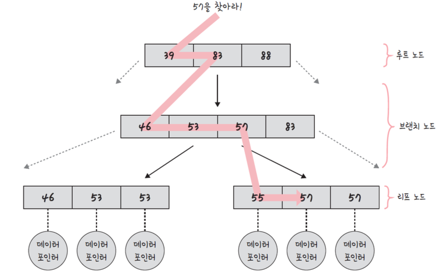

# 1. 인덱스의 구조와 효율적인 이유

* 인덱스는 데이터 접근(검색, 삽입, 삭제 등) 속도를 향상시키기 위해 사용되는 데이터 구조

## B-Tree

* 보통의 데이터베이스에서 사용되는 인덱스 구조
* 이진 검색 트리를 일반화한 자료구조
* 2개 이상의 자식을 가진 노드를 허용
* 탐색에 평균 O(logN) 시간이 걸림
* 대수확장성 이라는 특징으로 더 빠른 시간 안에 많은 양의 데이터를 빠르게 찾을 수 있는 구조

### B-Tree의 주요한 특징

1. 모든 리프노드들은 같은 레벨에 있음 = 균형잡힌 트리를 의미
2. B-트리의 차수는 노드가 가질 수 잇는 자식의 최대 수를 의미
    * 예를 들어, 차수가 4인 B-트리의 경우, 각 노드는 최대 4개의 자식을 가질 수 있음
3. B-트리는 노드 내에 여러 키를 저장하고, 각 키는 자식 노드들 사이의 값을 구분하는 역할을 함
    * 예를 들어, 7과 16 사이에는 7 이상 16 이하의 작은 값이 들어가야 함
4. 노드가 꽉 찼을 때, 새로운 항목 삽입을 위해 노드를 분할
5. 반대로, 삭제로 인해 노드 사용량이 줄어들면, 인접 노드와 병합할 수 있음

## B-트리의 작동 과정

* B-트리는 루트 노드, 브랜치 노드(내부 노드), 리프 노드 로 구성된 트리
* 핵심 원리는 요소들을 선형적으로 탐색하는 것이 아닌 트리라는 자료 구조를 이용해 **"있을 법한 노드"를 기반으롬 찾고자 하는 요소를 빠르게 찾는 것**
    * 예를 들어, E를 찾는다고 하면 전체 테이블을 탐색하는 것이 아니라, E가 있을 법한 리프 노드로 들어가서 E를 탐색
    * 이 자료 구조 없이 탐색하면 A~E까지 5번을 탐색해야 하지만, 이 자료 구조를 사용하면 두 번 만에 리프 노드를 찾을 수 있음
      

## B-트리의 대수확장성

* **대수확장성: 트리 깊이가 리프 노드 수에 비해 매우 느리게 성장하는 것**
* 4차 B-트리의 경우 기본적으로 인덱스가 한 깊이씩 증가할 때마다 최대 인덱스 항목의 수는 4배씩 증가

# 2. 인덱스 성능 최적화

## 1. 인덱스는 비용이다

1. 인덱스는 두 번 탐색하도록 강요함. 즉, 탐색에 따른 비용이 든다
    * 인덱스 리스트, 그 다음 컬렉션 순으로 탐색하기 때문에, 관련 읽기 비용이 들게 됨
    * 이때문에 사용되지 않거나 중복되는 인덱스, 불필요한 인덱스는 제거해야 함
2. 인덱스는 컬렉션이 수정됨에 따라 수정이 같이 되며 이에 따른 비용이 발생한다
    * 컬렉션이 수정되면 인덱스도 수정된다
    * 이때 B-트리의 높이를 균형있게 조절하는 비용도 들고 데이터를 효율적으로 조회할 수 있도록 분산시키는 비용도 든다
    * 인덱스에 포함된 컬럼의 크기가 클수록 인덱스의 크기도 커지기 때문에 가능한 한 컬럼의 크기를 작게 유지해서 인덱스의 효율을 높여야 함
        * ex. name, age, email 의 검색 조건에서, email은 중복되는 값이 거의 없기 때문에 name, age 만 인덱스로 설정해서 효율을 찾아야 함

## 2. 항상 테스팅하라

* 인덱스 최적화 기법은 도메인의 특징에 따라 달라짐
* 서비스에서 사용하는 데이터의 크기, 종류, 타입 등이 다름
* explain() 함수를 통해 인덱스를 만들고 쿼리를 보낸 이후에 테스팅을 하며 걸리는 시간을 최소화해야 함
* MySQL 기준

```mysql
EXPLAIN
SELECT *
FROM table_name
WHERE column_name = 'some_value';
```

* 쿼리 실행을 했을 때 테이블 풀스캔을 하고 잇는 것은 아닌지, 쿼리를 처리할 때 행의 수가 너무 많은 것은 아닌지 등을 알아봐야 함

## 3. 복합 인덱스 설정 방법

* 복합 인덱스를 설정할 때 인덱스 생성 순서도 중요

1. 동등: 어떠한 값과 같음을 비교하는 == 이나 equal 이라는 쿼리가 있다면 제일 먼저 인덱스로 설정
2. 정렬: 정렬에 쓰는 필드가 잇다면 그 다음 인덱스로 설정
3. 다중 값: 다중 값을 출력해야 하는 필드, 예를 들어 <, >, between 등 많은 값을 출력해야 하는 쿼리라면 그 다음 인덱스로 설정
4. 카디널리티: 유니크한 값의 정도가 높은 순서대로 설정. 예를 들어 age와 Email 중 email 먼저 설정

# DEEP DIVE: Clustered index 와 Non-clustered index 의 차이

## clustered index

* 클러스터형 인덱스
    * 유일성과 최소성을 가지는 기본키 중 하나로 설정
    * 테이블당 한 개
    * 보통 테이블의 기본키가 클러스터형 인덱스가 됨
* 데이터 페이지가 정렬되서 저장되며 인덱스 페이지의 리프노드에 "데이터페이지"가 들어가 있음
    * 정렬되었기 때문에 탐색에 장점
* 데이터가 추가될 때마다 다시 모든 테이블을 정렬해야 함
    * 삽입, 삭제, 수정이 느림
* 인덱스 순서와 데이터의 순서가 일치함

## non-clustered index

* 보조 인덱스라고 함
    * 한 개가 아닌 여러 개를 만들 수 있음
    * 클러스터형 키가 복합키가 될 수 있긴 하나 보통 복합키를 만든다고 했을 때 보조 인덱스로 만듬
* 클러스터형과는 달리 인덱스 페이지 리프노드에 실제 데이터가 있는 것이 아니라 데이터 페이지에 관한 포인터가 있음
* 정렬되어있지 않아 탐색은 느림
    * 삽입, 삭제, 수정이 빠름
* 인덱스 순서와 데이터 순서가 일치하지 않음

## 클러스터형 인덱스 생성방법

* primary key: 클러스터형 인덱스

```mysql
alter table add primary key
```

## 보조 인덱스를 만드는 방법

```mysql
create index .. alter table add index
```

* 주의사항
    * 무조건 primary key로 설정한다고 해서 클러스터형 인덱스로 설정되는 것이 아님
    * SQL Server의 경우 반례가 있음
```sql
/* Non-clustered index */
ALTER TABLE MyTable
    ADD CONSTRAINT PK_MyTable
        PRIMARY KEY NONCLUSTERED(WidgetId);
```
