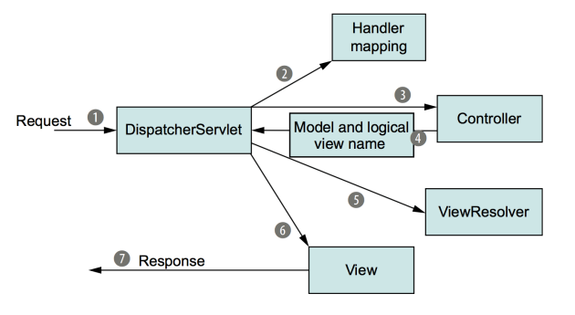
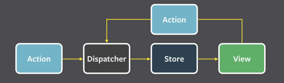

# 1. 소개

* 프로그램을 설계할 때 발생했던 문제점들을 객체 간의 상호 관계 등을 이용하여 해결할 수 있도록 하나의 ‘규약’ 형태로 만들어 놓은 것
* 종류
    * **생성 패턴**
        * 객체 생성 방법
            * **싱클톤, 팩토리**, 추상팩토리, 빌더, 프로토타입 패턴
    * **구조 패턴**
        * 객체, 클래스 등으로 큰 구조를 만들 때 유연하고 효율적으로 만드는 방법
            * **프록시**, 어댑터, 브리지, 복합체, 데코레이터, 퍼사드, 플라이웨이트 패턴
    * **행동 패턴**
        * 객체나 클래스 간의 알고리즘, 책임 할당에 관한 패턴
            * **이터레이터, 옵저버, 전략**, 책임연쇄, 커맨드, 중재자, 메멘토, 상태, 템플릿메서드, 비지터 패턴

# 2. 라이브러리와 프레임워크의 차이

## 1. 라이브러리

* 공통으로 사용될 수 있는 특정한 기능들을 모듈화한 것
* **폴더명, 파일명 등에 대한 규칙이 없고** 프레임워크에 비해 자유로움

## 2. 프레임워크

* 공통으로 사용될 수 있는 특정한 기능들을 모듈화한 것
* **폴더명, 파일명 등에 대한 규칙이 있으며** 라이브러리에 비해 좀 더 엄격함

# 3. 디자인 패턴

## 1. 싱글톤 패턴

* 하나의 클래스에 오직 하나의 인스턴스만 가지는 패턴

### 장점

* 인스턴스 생성에 많은 코스트가 드는 데이터베이스 연결 모듈 등(I/O Bound)에 많이 쓰이며 인스턴스 생성을 효율적으로 함

### 단점

* 의존성이 높아지고
* TDD를 할 때 불편함: 테스트마다 '독립적인' 인스턴스를 만들기가 어려움

### 구현 코드

```java
class Singleton {
    private static class singleInstanceHolder {
        private static final Singleton INSTANCE = new Singleton();
    }

    public static Singleton getInstance() {
        return singleInstanceHolder.INSTANCE;
    }
}

public class HelloWorld {
    public static void main(String[] args) {
        Singleton a = Singleton.getInstance();
        Singleton b = Singleton.getInstance();

        System.out.println(a.hashCode());
        System.out.println(b.hashCode());

        if (a == b) {
            System.out.println(true);
        }
    }
}
/*
705927765
705927765
true

1. 클래스안에 클래스(Holder), static이며 중첩된 클래스인 singleInstanceHolder를
기반으로 객체를 선언했기 때문에 한 번만 로드되므로 싱글톤 클래스의 인스턴스는 애플리케이션당 하나만 
존재하며 클래스가 두 번 로드되지 않기 때문에 두 스레드가 동일한 JVM에서 2개의 인스턴스를 생성할 수 없음.
그렇기 때문에 동기화, 즉 synchronized를 신경쓰지 않아도 됨
2. final 키워드를 통해서 read only 즉, 다시 값이 할당되지 않도록 함
3. 중첩클래스 Holder로 만들었기 때문에 싱글톤 클래스가 로드될 때 클래스가 메모리에 로드되지 않고 
어떠한 모듈에서 getInstance() 메서드가 호출할 때 싱글톤 객체를 최초로 생성 및 리턴하게 됨
*/
```

## 2. DEEP DIVE: 싱글톤 패턴 구현하는 7가지 방법

### 1. 단순 메서드 호출

* 싱글톤 패턴 생성 여부를 확인하고 싱글톤이 없으면 새로 만들고, 있다면 만들어진 인스턴스를 반환
* 메서드의 원자성이 결여되어있음. 멀티스레드 환경에서는 싱글톤 인스턴스를 2개 이상 만들 수 있음

```java
public class Singleton {
    private static Singleton instance;

    private Singleton() {
    }

    public static Singleton getInstance() {
        if (instance == null) {
            instance = new Singleton();
        }
        return Singleton;
    }
}
```

### 2. synchronized

* 최초로 접근한 스레드가 해당 메서드 호출시에 다른 스레드가 접근하지 못하도록 잠금(lock)을 걸어줌
* 이 때 getInstance() 메서드를 호출할 때마다 lock이 걸려 성능 저하
* 인스턴스가 만들어졌는데도 getInstacne()는 호출이 가능하니 해당 부분도 좋지 않다

```java
public class Singleton {
    private static Singleton instance;

    private Singleton() {
    }

    public static synchronized Singleton getInstance() {
        if (instance == null) {
            instance = new Singleton();
        }
        return Singleton;
    }
}
```

### 3. 정적 멤버

* 런타임이 아니라 최초에 JVM이 클래스 로딩 때 모든 클래스들을 로드할 때 미리 인스턴스를 생성하는데 이를 이용한 방법
* 클래스 로딩과 동시에 싱글톤 인스턴스를 만든다. 그렇기 때문에 모듈들이 싱글톤 인스턴스를 요청할 때 그냥 만들어진 인스턴스를 반환
* 이는 불필요한 자원낭비라는 문제점 싱글톤 인스턴스가 필요없는 경우도 무조건 싱글톤 클래스를 호출해 인스턴스를 만들어야 하기 때문

```java
public class Singleton {
    private final static Singleton instance = new Singleton();

    private Singleton() {
    }

    public static Singleton getInstance() {
        return instance;
    }
}
```

### 4. 정적 블록

```java
public class Singleton {
    private static Singleton instance = null;

    static {
        instance = new Singleton();
    }

    private Singleton() {
    }

    public static Singleton getInstance() {
        return instance;
    }
}
```

### 5. 정적 멤버와 Lay Holder(중첩 클래스)

* singleInstanceHolder 라는 내부 클래스를 하나 더 만듬으로써, Singleton클래스가 최초에 로딩되더라도 함께 초기화가 되지 않고 getInstance()가 호출될 때
  singleInstanceHolder 클래스가 로딩되어 인스턴스를 생성
* 필요할 때만 생성 가능

```java
class Singleton {
    private static class singleInstanceHolder {
        private static final Singleton INSTANCE = new Singleton();
    }

    public static Singleton getInstance() {
        return singleInstanceHolder.INSTANCE;
    }
}
```

### 6. 이중 확인 잠금(DCL)

* 인스턴스 생성 여부를 싱글톤 패턴 잠금 전에 한번, 객체를 생성하기 전에 한 번, 총 2번 체크하면 인스턴스가 존재하지 않을 때만 잠금을 걸 수 있기 때문에 문제 해결 가능

```java
public class Singleton {
    private volatile Singleton instance;

    private Singleton() {
    }

    public Singleton getInstance() {
        if (instance == null) {
            synchronized (Singleton.class) {
                if (instance == null) {
                    instance = new Singleton();
                }
            }
        }
        return instance;
    }
}
```

* JAVA는 스레드 2개가 열리면 변수를 메인 메모리(RAM)으로부터 가져오는 것이 아니라 캐시메모리에서 각각의 캐시메모리를 기반으로 가져오게 된다.
* volatile 을 사용하면 캐시메모리가 아니라 메인메모리에서 변수를 가져옴
* 멀티스레드 상황에서 변수값 불일치 해결을 위해 volatile 사용

### 7. enum

* enum의 인스턴스는 기본적으로 스레드세이프(thread safe)한 점이 보장됨

```java
public enum SingletonEnum {
    INSTANCE;

    public void oortCloud() {
    }
}
```

### 결론: 최고의 방법은?

* 5번. 정적 멤버와 Lay Holder(중첩 클래스)
    * 가장 많이 사용
* 7번. enum
    * 이펙티브 자바 추천

## 3. 팩토리 패턴

* 상속 관계에 있는 두 클래스에서 상위 클래스가 중요한 뼈대를 결정하고, 하위 클래스에서 객체 생성에 관한 구체적인 내용을 결정하는 패턴
* 상위 클래스에서는 객체 생성방식에 대해 알 필요가 없어져 유연성을 갖게 되며 객체 생성 로직은 하위클래스에서만 관리 되기 때문에 유지보수성이 증가

```java
enum CoffeeType {
    LATTE,
    ESPRESSO
}

abstract class Coffee {
    protected String name;

    public String getName() {
        return name;
    }
}

class Latte extends Coffee {
    public Latte() {
        name = "latte";
    }
}

class Espresso extends Coffee {
    public Espresso() {
        name = "Espresso";
    }
}

class CoffeeFactory {
    public static Coffee createCoffee(CoffeeType type) {
        return switch (type) {
            case LATTE -> new Latte();
            case ESPRESSO -> new Espresso();
        };
    }
}

public class Main {
    public static void main(String[] args) {
        Coffee coffee = CoffeeFactory.createCoffee(CoffeeType.LATTE);
        System.out.println(coffee.getName());   // Latte
    }
}
```

## 4. 이터레이터 패턴

* 이터레이터를 사용하여 컨테이너의 요소들에 접근하는 디자인 패턴
* 각기 다른 자료구조들은 똑같은 인터페이스로 순회를 쉽게 할 수 있다는 장점
* 컨테이너란 동일한 요소들을 담아놓는 집합
    * 배열, 맵 등

## 5. DI와 DIP

### 의존성 주입(Dependency Injection)

* 메인 모듈이 '직접' 다른 하위 모듈에 대한 의존성을 주기보다는 중간에 의존성 주입자(dependency injector)가 이 부분을 가로채 메인 모듈이 '간접'적으로 의존성을 주입하는 방식
* 메인 모듈과 하위모듈간의 의존성을 조금 더 느슨하게 만들 수 있으며 모듈을 **쉽게 교체 가능**한 구조로 만든다.
* A가 B에 의존한다
    * B가 변하면 A에 영향을 미친다 = A -> B

### 의존관계역전원칙(Dependency Inversion Principle)

* 의존성 주입을 할 때는 의존관계역전원칙이 적용됨
* 2가지 규칙을 지기키는 상태
    * 상위 모듈은 하위 모듈에 의존해서는 안된다. 둘다 추상화에 의존해야 한다.
    * 추상화는 세부사항에 의존해서는 안된다. 세부사항은 추상화에 따라 달라져야 한다.

### 의존성 주입의 장점

* 외부에서 모듈을 생성하여 dev.add(new BackendDeveloper()) 이런식으로 집어넣는 구조가 되기 대문에 모듈들을 쉽게 교체할 수 있는 구조가 된다.
* 단위 테스팅과 마이그레이션이 쉬워짐
* 애플리케이션 의존성 방향이 좀 더 일관되어 코드를 추론하기가 쉬워짐

### 의존성 주입의 단점

* 결국에는 모듈이 더 생기게 되므로 복잡도가 증가
* 종속성 주입자체가 컴파일을 할 때가 아닌 런타임때 일어나기 때문에 컴파일을 할때 종속성 주입에 관한 에러를 잡기 어려워질 수 있다.

## 6. 전략 패턴

* 전략이라고 부르는 '캡슐화한 알고리즘'을 컨텍스트 안에서 바꿔주면서 상호 교체가 가능하게 만드는 디자인 패턴

```java
import java.text.DecimalFormat;
import java.util.ArrayList;
import java.util.List;

interface PaymentStrategy {
    void pay(int amount);
}

class KAKAOCardStrategy implements PaymentStrategy {
    private String name;
    private String cardNumber;
    private String cvv;
    private String dateOfExpiry;

    public KAKAOCardStrategy(String nm, String ccNum,
                             String cvv, String expiryDate) {
        this.name = nm;
        this.cardNumber = ccNum;
        this.cvv = cvv;
        this.dateOfExpiry = expiryDate;
    }

    @Override
    public void pay(int amount) {
        System.out.println(amount + " paid using KAKAOCard.");
    }
}

class LUNACardStrategy implements PaymentStrategy {
    private String emailId;
    private String password;

    public LUNACardStrategy(String email, String pwd) {
        this.emailId = email;
        this.password = pwd;
    }

    @Override
    public void pay(int amount) {
        System.out.println(amount + " paid using LUNACard.");
    }
}

class Item {
    private String name;
    private int price;

    public Item(String name, int cost) {
        this.name = name;
        this.price = cost;
    }

    public String getName() {
        return name;
    }

    public int getPrice() {
        return price;
    }
}

class ShoppingCart {
    List<Item> items;

    public ShoppingCart() {
        this.items = new ArrayList<>();
    }

    public void addItem(Item item) {
        this.items.add(item);
    }

    public void removeItem(Item item) {
        this.items.remove(item);
    }

    public int calculateTotal() {
        int sum = 0;

        for (Item item : items) {
            sum += item.getPrice();
        }
        return sum;
    }

    public void pay(PaymentStrategy paymentMethod) {
        int amount = calculateTotal();
        paymentMethod.pay(amount);
    }
}

public class HelloWorld {
    public static void main(String[] args) {
        ShoppingCart cart = new ShoppingCart();
        Item A = new Item("kundolA", 100);
        Item B = new Item("kundolB", 300);
        cart.addItem(A);
        cart.addItem(B);
        // pay by LUNACard
        cart.pay(new LUNACardStrategy("jyd@example.com", "pukubababo"));
        // pay by KAKAOBank
        cart.pay(new KAKAOCardStrategy("Jung Yeongdong", "123456789", "123", "12/01"));
    }
}
```

## 7. 옵저버 패턴

* 주체가 어떤 객체(subject)의 상태 변화를 관찰하다가 상태 변화가 있을 때마다 메서드 등을 통해 옵저버 목록에 있는 옵저버들에게 변화를 알려 주는 디자인 패턴

```java
import java.util.ArrayList;
import java.util.List;

interface Subject {
    void register(Observer obj);

    void unregister(Observer obj);

    void notifyObservers();

    Object getUpdate(Observer obj);
}

interface Observer {
    void update();
}

class Topic implements Subject {
    private List<Observer> observers;
    private String message;

    public Topic() {
        this.observers = new ArrayList<>();
        this.message = "";
    }

    @Override
    public void register(Observer obj) {
        if (!observers.contains(obj)) observers.add(obj);
    }

    @Override
    public void unregister(Observer obj) {
        observers.remove(obj);
    }

    @Override
    public void notifyObservers() {
        this.observers.forEach(Observer::update);
    }

    @Override
    public Object getUpdate(Observer obj) {
        return this.message;
    }

    public void postMessage(String msg) {
        System.out.println("Message sent to Topic: " + msg);
        this.message = msg;
        notifyObservers();
    }
}

class TopicSubscriber implements Observer {
    private String name;
    private Subject topic;

    public TopicSubscriber(String name, Subject topic) {
        this.name = name;
        this.topic = topic;
    }

    @Override
    public void update() {
        String msg = (String) topic.getUpdate(this);
        System.out.println(name + ":: got message >> " + msg);
    }
}

public class HelloWorld {
    public static void main(String[] args) {
        Topic topic = new Topic();
        Observer a = new TopicSubscriber("a", topic);
        Observer b = new TopicSubscriber("b", topic);
        Observer c = new TopicSubscriber("c", topic);
        topic.register(a);
        topic.register(b);
        topic.register(c);

        topic.postMessage("amumu is op champion!!");
    }
}
/*
Message sent to Topic: amumu is op champion!!
a:: got message >> amumu is op champion!!
b:: got message >> amumu is op champion!!
c:: got message >> amumu is op champion!!
*/ 
```

## 8. 프록시 패턴

* 객체가 어떤 대상 객체에 접근하기 전, 그 접근에 대한 흐름을 가로채서 해당 접근을 필터링하거나 수정하는 등의 역할을 하는 계층이 있는 디자인 패턴
* 캐싱, 로깅 등에 활용하는 프록시 서버
* 보통 서비스 앞단에 프록시 서버로 cloudflare를 둬서 불필요한, 또는 공격적인 트래픽을 막는다.

## 9. MVC 패턴과 MVP패턴 그리고 MVVM패턴

### 1. MVC 패턴

* 모델, 뷰, 컨트롤러로 이루어진 디자인 패턴
* 모델
    * 애플리케이션의 데이터인 데이터베이스, 상수, 변수 등을 뜻함
    * 뷰에서 데이터를 생성하거나 수정할 때 컨트롤러를 통해 모델이 생성 또는 업데이트됨
* 뷰
    * 사용자 인터페이스 요소를 나타내며 모델을 기반으로 사용자가 볼 수 있는 화면
    * 모델이 가지고 있는 정보를 따로 저장하지 않아야 하며 변경이 일어나면 컨트롤러에 이를 전달해야 함
* 컨트롤러
    * 하나 이상의 모델과 하나 이상의 뷰를 잇는 다리 역할을 하며 이벤트 등 메인 로직을 담당
    * 모델과 뷰의 생명주기도 관리하며, 모델이나 뷰의 변경 통지를 받으면 이를 해석해서 각각의 구성요소에 해당 내용에 대해 알려줌
* 장점
    * 애플리케이션의 구성 요소를 세 가지 역할로 구분하여 개발 프로세스에서 각각의 구성 요소에만 집중해서 개발할 수 있음
    * 재사용성과 확장성이 용이
* 단점
    * 애플리케이션이 복잡해질수록 모델과 뷰의 관계가 복잡해짐
* Spring WEB MVC

### 2. MVP 패턴

* C가 P(presenter)로 교체된 패턴
* V와 P는 1:1 관계이므로 MVC보다 강한 결합을 지님

### 3. MVVM 패턴

* C가 VM(View Model)로 바뀐 패턴
* VM은 뷰를 추상화한 계층이며 VM : V = 1 : N 이라는 관계를 가짐
* VM은 커맨드와 데이터바인딩을 가짐
    * 커맨드: 여러 요소에 대한 처리를 하나의 액션으로 처리할 수 있는 기법
    * 데이터바인딩: 화면에 보이는 데이터와 브라우저상의 메모리 데이터를 일치시키는 방법
* Vue.js

### 4. Spring의 MVC패턴 적용사례

* 디스패처 서블릿의 요청 처리 과정
  

1. 클라이언트가 요청을 했을 때 가장 먼저 디스패처 서블릿이 이를 받음(프론트 컨트롤러)   
   보통 @RequestMapping을 참고해서 어떤 컨트롤러에게 처리하게할지 결정
2. 하나 이상의 handler mapping을 참고해서 적절한 컨트롤러를 설정
3. 컨트롤러는 데이터베이스에 접근하여 데이터를 가져오는 등 비즈니스 로직을 수행
4. 사용자에게 전달해야할 정보인 모델을 생성
5. 뷰를 구현하기 위한 ViewResolver를 참고
6. 해당 정보를 기반으로 뷰를 렌더링
7. 응답 데이터 전송

## 10. flux 패턴

* 단방향으로 데이터 흐름을 관리하는 디자인 패턴

### 구조



* Action
    * 사용자의 이벤트 담당
    * 마우스 클릭, 글 쓰기 등을 의미하여 해당 이벤트에 관한 객체를 만들어내 dispatcher에게 전달
* Dispatcher
    * 들어오는 Action 객체 정보를 기반하여 어떠한 "행위"를 할 것인가를 결정
    * 보통 action객체의 type을 기반으로 미리 만들어놓은 로직(switch)을 수행하고 이를 Store에 전달
* Store
    * 애플리케이션 상태 관리 및 저장 계층
    * 도메인의 상태, 사용자의 인터페이스 등의 상태를 모두 저장
* View
    * 데이터를 기반으로 표출되는 사용자 인터페이스

### 장점

* 데이터의 일관성 증대
* 버그를 찾기 쉬워짐
* 단위테스팅이 쉬워짐
