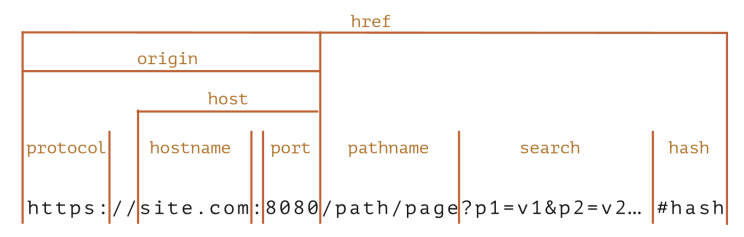

# 목차

1. [REST API](#rest-api)
    1. [RESTful한 API](#restful한-api)
    2. [REST API의 특징](#rest-api의-특징)
        - [Uniform-Interface](#1-uniform-interface)
            - [url 자원식별](#url-자원식별)
            - [표현을 통한 자원조작](#표현을-통한-자원조작)
            - [Self-descriptive messages](#self-descriptive-messages)
            - [HATEOAS 구조](#hateoas-구조)
        - [Stateless](#2-stateless)
        - [Cacheable](#3-cacheable)
        - [Client-Server 구조](#4-client-server-구조)
        - [Layered System](#5-layered-system)
    3. [REST API의 URI규칙](#rest-api의-uri규칙)

2. [브라우저 렌더링 과정](#브라우저-렌더링-과정)
    1. [브라우저 구성](#브라우저-구성)
    2. [DOM 트리와 CSSOM 트리 구축](#1-dom-트리와-cssom-트리-구축)
        - [DOM 트리 구축](#dom-트리-구축)
        - [CSSOM 트리 구축](#cssom-트리-구축)
    3. [렌더 트리와 렌더 레이어 생성](#2-렌더-트리와-렌더-레이어-생성)
    4. [렌더 레이어의 Layout 설정](#3-렌더레이어를-대상으로-layout-설정)
    5. [렌더 레이어 칠하기](#4-렌더레이어를-대상으로-칠하기paint)
    6. [레이어 합치기 및 표기](#5-레이어-합치기composite-layer-및-표기)

3. [www.naver.com을 쳤을 때 생기는 과정과 DNS](#wwwnavercom을-쳤을-때-생기는-과정과-dns)
    1. [리다이렉트](#리다이렉트)
    2. [캐싱](#캐싱)
        - [브라우저 캐시](#브라우저-캐시)
        - [공유 캐시](#공유-캐시)
    3. [DNS](#dns)
        - [DNS 캐싱](#dns-캐싱)
    4. [IP 라우팅 및 ARP](#ip-라우팅-및-arp)
    5. [TCP 연결 구축](#tcp-연결-구축)
    6. [컨텐츠 다운로드](#컨텐츠-다운로드)
    7. [브라우저 렌더링](#브라우저-렌더링)

4. [이더넷 프레임](#이더넷-프레임)
    1. [프레임 구조](#프레임-구조)
        - [Preamble, SFD, DA, SA, EtherType](#preamble-sfd-da-sa-ethertype)
        - [Payload와 FCS](#payload와-fcs)

5. [CORS](#cors)
    1. [오리진과 SOP](#오리진과-sop)
        - [Same-Origin Policy](#same-origin-policy)
    2. [CORS 의미](#cors-의미)
    3. [Preflight request와 Simple request](#preflight-request-와-simple-request)
        - [헤더](#헤더)

6. [네이글 알고리즘](#네이글-알고리즘)
    1. [장점](#장점)
    2. [단점](#단점)

7. [HTTP의 멱등성](#http의-멱등성)
    1. [HTTP 메서드와 멱등성](#http-메서드와-멱등성)
        - [멱등성을 가지는 메서드](#멱등성을-가지는-메서드)
        - [멱등성을 가지지 않는 메서드](#멱등성을-가지지-않는-메서드)
    2. [멱등성을 고려한 API 설계](#멱등성을-고려한-api-설계)
    3. [멱등성이 중요한 이유](#멱등성이-중요한-이유)

# REST API

* RESTful한 API
* 일련의 특징과 규칙 등을 지키는 API

## REST API의 특징

### 1. Uniform-Interface

* API에서 자원들은 각각의 독립적인 인터페이스를 가지며 각각의 자원들이 url 자원식별, 표현을 통한 자원조작, Self-descriptive messages, HATEOAS 구조를 가지는 것
* 독립적인 인터페이스: 서로 종속적이지 않은 인터페이스
    * 웹페이지 변경시 웹 브라우저를 업데이트하는 일은 없어야 함
    * HTTP 명세나 HTML 명세가 변겨오디어도 웹페이지는 잘 작동해야 함

#### url 자원식별

* identification of resources
* 자원은 url로 식별되어야 함

#### 표현을 통한 자원조작

* manipulation of resources through representations
* url과 GET, DELETE 등 HTTP 표준메서드 등을 통해 자원을 조회, 삭제 등 작업을 설명할 수 있는 정보가 담겨야 함

#### Self-descriptive messages

* HTTP Header에 타입을 명시하고 각 메시지(자원)들은 MIME types에 맞춰 표현되어야 함
    * .json을 반환한다면 application/json으로 명시해주어야 함
    * MIME types: 문서, 파일 등의 특성과 형식을 나타내는 표준

#### HATEOAS 구조

* Hypermedia as the Engine of Application State
* 하이퍼링크에 따라 다른 페이지를 보여줘야 함
* 어떤 URL에서 원했는지 명시해주어야 함
* 보통 href, links, link, url 속성 중 하나에 해당 데이터의 URL을 담아서 표기

### 2. Stateless

* HTTP 자체가 Stateless하기 때문에 HTTP를 이용하는 것만으로도 만족
* REST API를 제공해주는 서버는 세션을 해당 서버쪽에 유지하지 않는다는 의미

### 3. Cacheable

* HTTP는 아무런 로직을 구현하지 않더라도 원래 캐싱이 됨
    * 이는 GET 메서드에 한정되며 max-age, Etag 등의 헤더로 캐싱 정보를 확인 가능

### 4. Client-Server 구조

* 클라이언트와 서버가 서로 독립적인 구조를 가져야 함
    * 서버는 그저 API를 제공하고 그 API에 맞는 비즈니스 로직을 처리하면 됨
    * 클라이언트는 HTTP로 받는 로직만 잘 처리하면 됨

### 5. Layered System

* 계층 구조로 나눠져 있는 아키텍쳐

## REST API의 URI규칙

1. 동작은 HTTP 메소드로만 해야 하고 url에 해당 내용이 들어가면 안됨
    * 수정 = put
    * 삭제 = delete
    * 추가 = post
    * 조회 = get 이용
2. 확장자는 표시하지 않음
3. 명사로만 표기
4. 계층적 내용을 담고 있어야 함
5. 소문자로만 쓰며 언더바(_)가 아닌 바(-)를 사용
6. HTTP 응답 상태코드를 적재적소에 활용

# 브라우저 렌더링 과정

## 브라우저 구성

* 브라우저 엔진
* 렌더링 엔진
* 네트워크 통신부
* 자바스크립트 해석기
* UI 백엔드
* 자료 저장소
  
* 렌더링 엔진이 브라우저 렌더링을 관장함
* DOM트리, CSS 파서 등을 기반으로 렌더트리를 구축해 화면 구축

## 1. DOM 트리와 CSSOM 트리 구축

### DOM 트리 구축

* html 페이지 내 div, span 등의 요소들이 HTML 파서에 의해 "구문 분석"됨
* 요소는 하나하나가 노드로 설정되어 트리 형태로 저장됨. 이를 DOM 트리라고 함
    * div > span, span 이라는 요소가 있다면 div라는 부모 노드 밑에 span이라는 자식 노드가 2개 생기는 것

### CSSOM 트리 구축

* 각각의 노드는 CSS 파서에 의해 정해친 스타일 규칙이 적용되어 있음
* 이런 것들을 기반으로 CSSOM 이라는 트리가 만들어짐
* 이 과정은 DOM 트리 구축과 "동시에" 일어남

## 2. 렌더 트리와 렌더 레이어 생성

* DOM 트리 + CSSOM 트리 - 렌더 객체(Render Object)가 생성됨
* 랜더 객체가 모여 병렬적인 렌더 트리가 생성됨
* 이때 display:none이 포함된 노드는 지워지고 font-size 등 상속적인 스타일은 부모노드에만 위치하도록 설계하는 등의 최적화를 거쳐 렌더레이어가 완성됨
* **중요**
    * display:none은 렌더 트리에서 삭제됨
    * visibility:hidden은 요소를 보이지 않게 하지만 요소는 여전히 레이아웃에서 공간을 차지함
* 렌더레이어가 완성될 때 GPU에서 처리되는 부분(CSS3D / video & canvas / filter / animation / transform: translateZ(0) 등)이 있으면 이 요소들은 각각
  강제적으로 그래픽 레이어(Graphic Layer)로 분리됨

## 3. 렌더레이어를 대상으로 Layout 설정

* 좌표는 보통 부모를 기준으로 설정됨
* Global Layout은 브라우저 사이즈가 증가하거나 폰트 사이즈가 커지면 변경됨

## 4. 렌더레이어를 대상으로 칠하기(paint)

* 픽셀마다 점을 찍듯 칠함
* 레스터화라고도 함

## 5. 레이어 합치기(composite layer) 및 표기

* 각각의 레이어로부터 비트맵이 생성되고 GPU에 텍스처로 업로드됨
* 그다음 텍스처들은 서로 합쳐져 하나의 이미지로 렌더링되며 화면으로 출력됨

## FAQ: 렌더트리와 DOM트리는 1:1 대응일까요?

* DOM트리 > 렌더객체 > 렌더트리가 되는 과정에서 display:none으로 사라지는 렌더 객체(노드)들이 있을 수 있기 때문에 1:1 대응이 아님

# www.naver.com 을 쳤을 때 생기는 과정, 그리고 DNS까지

* 리다이렉트, 캐싱, DNS, IP 라우팅 & ARP, TCP 연결 구축을 거쳐 요청, 응답이 일어나는 TTFB(Time To First Byte)가 시작됨
* 이후 컨텐츠를 다운받게 됨
* 이후 브라우저 렌더링 과정을 거쳐 네이버 화면이 나타남

## 리다이렉트

* 리다이렉트가 있으면 리다이렉트 진행
* 없으면 해당 요청에 대한 과정 진행

## 캐싱

* 해당 요청이 캐싱 가능한지 아닌지 파악
* 캐싱이 이미 된 요청이라면 캐싱된 값을 반환
* 캐싱이 되지 않은 새로운 요청이라면 다음 단계로 넘어감

### 브라우저 캐시

* 쿠키, 로컬스토리지 등을 포함한 캐시
    * 개인 캐시(private cache)라고도 함
* 브라우저 자체가 사용자가 HTTP를 통해 다운로드하는 모든 문서를 보유하는 것

### 공유 캐시

* 클라이언트와 서버 사이에 있으며 사용자간에 공유할 수 있는 응답을 저장
* 대표적인 예: 서버 앞단에 프록시 서버가 캐싱을 하는 것
    * NginX: 리버스 프록시를 둬서 내부 서버로 포워드
    * AWS CloudFront, cloudflare와 같은 CDN을 둬서 캐싱 가능

## DNS

* 브라우저가 요청한 FQDN(Fully Qualified Domain Name)인 www.naver.com 등의 이름을 DNS를 통해 실제 IP 주소 확인

### DNS 캐싱

* 미리 해당 도메인이름을 요청했다면 로컬 PC에 자동적으로 저장됨
* 브라우저 캐싱과 OS 캐싱이 있음

## IP 라우팅

* 해당 IP를 기반으로 IP 라우팅이 일어나고 ARP 과정을 거쳐 실제 서버를 찾음

## TCP 연결 구축

* 브라우저가 TCP 3way - handshake 및 SSL 연결 등을 통해 연결 설정
* 요청을 보낸 후 해당 요청한 서버(네이버)로부터 응답을 받음

## 컨텐츠 다운로드

* 브라우저는 사용자가 요청한 컨텐츠를 서버로부터 다운로드 받음

## 브라우저 렌더링

* 받은 데이터를 바탕으로 브라우저 엔진이 브라우저 렌더링 과정을 거쳐 화면을 만듬

# 이더넷 프레임

* 데이터 링크 계층의 데이터 단위
* 이더넷 프레임을 기반으로 데이터가 전달되며 다음과 같은 필드로 구성
    * Preamble(7바이트): 이더넷 프레임이 시작임을 알림
    * SFD(1바이트): Start frame delimiter, 다음 필드부터 주소필드가 시작됨을 알려줌
    * Destination Address(6바이트): 목적지 주소
    * Source Address(6바이트): 시작지 주소
    * EtherType(2바이트): 데이터링크계층 위의 IP 프로토콜 정의(IPv4, IPv6)
    * Payload(가변바이트): 데이터 또는 페이로드라고 함. 이진데이터로 구성됨. IEEE 표준은 최대 1500 바이트로 지정
    * FCS(4바이트): frame check sequence이며 수신 측의 에러 검출을 위해 삽입하는 필드. CRC 에러 검출 기법에 의해 생성된 비트 배열이 여기에 담김
        * 비트배열을 기반으로 수신된 데이터가 손상되었는지 확인하고 에러 확인시에는 해당 프레임을 폐기하고 송신 측에 재전송을 요구함

# CORS

## 오리진과 SOP

### Same-Origin Policy

* 브라우저 상에서 오로지 같은 오리진끼리만 요청을 허가하는 보안 정책
* 악성 스크립트가 다른 오리진의 서버에 요청을 보내고 사용자의 리소스를 임의적으로 접근하는 것을 방지
* Open API 등 다른 오리진끼리 요청해야 하는 필요성이 있음
    * SOP를 조금 더 유연하게 바꿔서 이러한 경우에 요청 및 응답할 수 있게 만든 매커니즘이 CORS

## CORS 의미

* Cross Origin Resource Sharing: HTTP 헤더 기반으로 브라우저가 다른 오리진에 대한 리소스 로드를 허용할지 말지에 대한 매커니즘

## Preflight request 와 Simple request

### 과정

* 요청을 보낼 때 다음의 메서드 타입, 헤더에 해당되지 않은 게 하나라도 포함되어있다면 preflight request를 보내게 됨
* 반대로 다음의 메서드 타입, 헤더를 모두 가진 요청을 간단한 요청(simple request)이자 안전한 요청이라고 함
* preflight request 과정

1. OPTIONS 메서드로 해당 서버에 원래의 요청을 보내기 전 요청을 보냄
2. 요청을 받은 서버는 Access-Control-* 헤더로 응답
3. Access-Control-* 헤더에 요청한 오리진이 존재하지 않는다면 CORS 에러를 보내게 됨

### 헤더

* Accept
* Accept-Language
* Content-Language
* Content-Type
    * application/x-www-form-urlencoded
    * multipart/form-data
    * text/plain
* Range

# 네이글 알고리즘

* 네트워크의 효율성을 높이기 위해 네트워크를 통해 전송되어야 하는 패킷의 수를 줄이고, 적은 양의 데이터를 자주 보내면 발생되는 대역폭 낭비를 막아주는 방법
* 패킷을 보낼 때 고정 크기의 버퍼에 모아두고 버퍼에 어느정도 차면 그때 보내고 다시 ACK가 오면 버퍼에 찬 데이터를 보내는 방식

## 장점

1. 네트워크 혼잡 감소
    * 패킷 수가 많으면 네트워크 장비(라우터, 스위치 등)에 더 많은 처리 부담을 주고, 이는 네트워크 혼잡을 증가시킬 수 있음
    * 패킷 수를 줄임으로써 네트워크의 전반적인 혼잡 상태를 개선하고, 패킷 손실률을 줄일 수 있음
2. 오버헤드 감소
    * 네트워크 패킷은 데이터를 전송할 때 필요한 제어 정보인 헤더를 포함
    * 작은 패킷들이 많이 전송될 때, 각 패킷에 포함된 헤더의 총량이 상당해져 유용한 데이터 전송보다 많은 대역 폭을 소모할 수 있음
    * 패킷의 수를 줄이면 이러한 오버헤드를 감소시켜 더 많은 유용한 데이터를 같은 양의 대역폭으로 전송할 수 있음

## 단점

1. 지연시간 증가
    * 작은 패킷의 수를 줄이기 위해 데이터를 버퍼링하고, 충분한 양의 데이터가 모일 때까지 패킷 전송을 지연시킴
    * ACK를 받기 전까지 데이터를 전송하지 않기 때문에 지연시간이 발생할 수 있음
    * 이로 인해 실시간으로 데이터를 전송해야 하는 애플리케이션(예: 온라인 게임)에서는 적합하지 않음

# HTTP의 멱등성

* idempotent란 하나의 요처잉 아닌 여러 번 동일한 요청을 보냈을 때 서버가 같은 상태를 가지는 것

## HTTP 메서드와 멱등성

### 멱등성을 가지는 메서드

* GET
    * 서버에서 정보를 가져오는데 사용
    * 여러 개의 동일한 GET 요청을 하는 것은 한 번의 요청을 하는 것과 같은 효과
    * 안전한 메서드
* HEAD
    * GET 요청이 생성하는 응답의 헤더를 검색하는데 사용됨
    * 보통 리소스 전체를 다운로드하는 오버헤드를 피하고 어떤 유형의 데이터가 반환되는지, 해당 리소스가 있는지, 수정날짜 등을 확인하기 위해 사용
    * 안전한 메서드
* OPTIONS
    * 대상 리소스의 통신 옵션(서버에서 지원하는 HTTP메서드 등)을 가져올 때 사용
    * 안전한 메서드
* PUT
    * 리소스를 완전히 다른 버전으로 대체
    * 요청이 반복되면 동일한 리소스가 다시 대체되어 첫 번째 요청 후와 동일한 상태가 됨
* DELETE
    * 리소스를 삭제하는데 사용
    * 리소스가 삭제되면 삭제 작업을 반복해도 시스템 상태가 더이상 변경되지 않음

### 멱등성을 가지지 않는 메서드

* POST
    * 새로운 리소스를 생성하는데 사용
    * 여러 POST 요청은 여러 리소스를 생성하는 결과를 초래함
* PATCH
    * 리소스를 부분적으로 업데이트하는데 사용
    * 멱등성 여부는 PATCH 실행 방법에 따라 달라짐
        * 필드를 특정 값으로 수정하는 것이라면 멱등성을 가짐
        * 특정 필드의 값을 증가시키거나 해당 배열에 요소를 추가시키는 것이라면 멱등성을 가지지 않음

## 멱등성을 고려한 API

* POST 메서드의 경우 헤더에 idempotency Key를 보내서 동일 요청인지 식별함
* 동일한 작업의 재시도를 인식하고 한 번만 처리되도록 함
* 중복 트랜잭션을 피해야하는 결제 처리 API에서 자주 사용

## 멱등성이 중요한 이유

1. 일관성
    * 반복되는 요청이 단일 요청과 동일한 효과를 갖도록 보장하는 것은 시스템 전반에 걸쳐 일관된 상태를 유지하는데 도움이 됨
2. 유지보수성
    * 멱등성을 가진 HTTP 메서드로 API 통신하는 부분에 있어서는 재시도를 처리할 때의 사이드이펙트를 고려한 복잡한 로직을 구현할 필요가 없기 때문에 이 부분을 잘 고려해서 설계한다면 유지보수성 증가