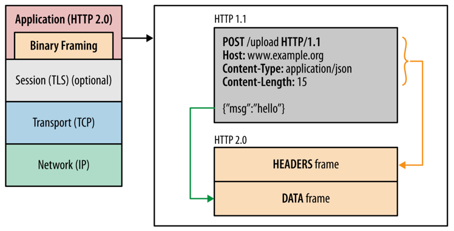
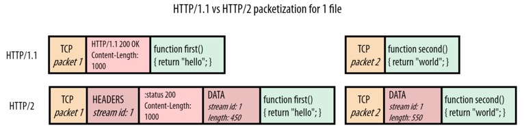

# 1. Http header

* 콜론(:)으로 서로 구분되는 key - value 형태로 설정

## 1. 일반헤더

* 요청한 URL, 요청 메서드, 해당 자원을 요청할 때 해당자원의 출처를 나타내는 URL을 노출시킬지 말지를 정하는 보안정도가 설정되어있는 Referrer Policy 등이 들어감

## 2. 요청헤더

* 클라이언트가 서버에 요청할 때 클라이언트가 설정하는 또는 자동으로 설정되는 헤더
* 메서드, 클라이언트의 OS, 브라우저 정보 등

## 3. 응답헤더

* 서버가 클라이언트에게 응답을 보낼 때 설정한느 또는 자동으로 설정되는 헤더
* 서버의 소프트웨어 정보 등
* 대부분의 서버는 일반적으로 해커가 서버에서 어떤 소프트웨어가 사용되고 있는지 알기 어렵게 하기 위해 서버 정보를 숨김

# 2. DEEP DIVE: HTTP/1.0과 HTTP/1.1의 차이, keep-alive, HOL

## 1. HTTP/1.0

* 수명이 짧은 연결
* HTTP요청은 자체 요청에서 완료
* 각 HTTP 요청당 TCP 핸드셰이크가 발생되며 기보적으로 한 연결당 하난의 요청을 처리하도록 설계됨
* 한번 연결할 때마다 TCP 연결을 계속 해야하니 RTT가 늘어나는 문제점 발생

## 2. HTTP/1.1

1. keep-alive default

* 매번 데이터를 요청할 때마다 TCP 연결을 하는 게 아닌 한번 해놓고 계속해서 데이터를 받을 수 있도록 만듬
* keep-alive header
    * TCP 연결을 유지하는 것을 알려주는 헤더로 연결유지시간인 timeout과 최대 요청수 max를 정할 수 있음

2. 호스트 헤더

* HTTP/1.0은 서버가 하나의 호스트만 가진다고 가정하기 대문에 HTTP/1.0은 헤더에 호스트를 포함하지 않았음
* 이때문에 하나의 IP에 하나의 호스트만 가질 수 있었음
* 사실 서버는 여러 개의 호스트를 가질 수 있으며, 이런 유연성을 위해 HTTP/1.1은 헤더에 특정 호스트를 포함할 수 있게 변경됨
* 항상 호스트를 포함해서 요청하도록 바뀜

3. 대역폭 최적화

* HTTP/1.0의 경우 어떠한 파일을 다운로드 받다가 연결이 끊기면 다시 다운로드 받는 것이 불가능
* HTTP/1.1의 경우 연결이 끊겨도 다시 다운로드 가능

## 요청을 줄이기 위한 기술

* 서버요청할 때마다 RTT는 계속해서 증가하기 때문에 요청을 줄이기 위해 여러 기술이 등장

### 이미지 스프라이트

* 수많은 이미지를 하나의 이미지로 만들어 하나의 이미지만 다운받아놓고 이를 통해 수많은 이미지를 다운받는 듯한 효과를 내는 것

### 코드 압축

* 띄어쓰기, 들여쓰기 등 코드를 압축

### 이미지 Base64 인코딩

* 이미지 파일을 64진법으로 이루어진 문자열로 인코딩해서 이미지 서버에 대한 HTTP 요청을 할 필요가 없이 만드는 것
* 하지만 Base64 인코딩을 할 경우 파일 크기가 37퍼센트 커지는 단점이 있음

## HTTP/1.1의 고질적인 문제: HOL

* HOL(Head Of Line Blocking)
    * 네트워크에서 같은 큐에 있는 패킷이 그 첫 번째 패킷에 의해 지연될 때 발생하는 성능 저하 현상

# 3. DEEP DIVE: HTTP/2와 HTTP/3의 차이

## 1. HTTP/2

### 바이너리 포맷 계층

* 애플리케이션 계층과 전송 계층 사이에 바이너리 포맷 계층을 추가
* HTTP 1.0은 일반 텍스트 메시지를 전송하고 줄바꿈으로 데이터를 나눔
* HTTP 2.0은 0과 1로 이루어진 바이너리 데이터로 변경되었고 더 작은 메시지가 프레임으로 캡슐화되어 전송됨
  

### 멀티플렉싱

* 단일 TCP연결의 여러 스트림에서 여러 HTTP 요청과 응답을 비동기적으로 보낼 수 있음
    * 이를 통해 HOL을 해결
* HTTP 1.1에서는 병렬 요청을 하려면 다중 TCP연결을 통해서 하고, 일반적으로는 TCP 연결 하나당 병렬 요청은 불가능했음
* HTTP 2.0에서는 리소스를 작은 프레임으로 나누고 이를 스트림으로 프레임을 전달
* 각각의 프레임은 스트림ID, 해당 청크의 크기를 나타내는 프레임이 추가되었기 때문에 작게 나눠서 다운로드가 되더라도 결과적으로 응답데이터에서는 올바른 순서로 재조립할 수 있게 됨
  

### 서버푸시

* 서버가 리소스를 클라이언트에 푸시할 수 있음
* 요청된 html파일과 함께 다른 개체를 별도로 보낼 수 있음
* 만약 요청한 html에 css가 포함되어있다면 별도 요청없이 css를 같이 보낼 수 있음

### 헤더압축

* HTTP 1.1에서는 무거운 헤더가 있었지만 이를 허프만 인코딩 압축 방법 등으로 압축시킴
* 똑같은 서버에서 2개의 이미지를 준다고 했을 때 중복되는 헤더는 제외한 채 보내고 해당 공통 필드로 헤더를 재구성하며 중복되지 않은 헤더값은 허프만 인크딩 압축 방법으로 압축해 전송
    * 허프만 인크딩: 문자열을 문자 단위로 쪼개 빈도수를 세어 빈도가 높은 정보는 적은 비트수를 사용해 표현하고, 빈도가 낮은 정보는 비트 수를 많이 사용하여 전체 데이터 표현에 필요한 비트양을 줄이는 알고리즘

### 우선순위

* 서버에서 원한느 순서대로 우선순위를 정해 리소스를 전달할 수 있음

## HTTP/3

* HTTP/2는 여전히 TCP를 사용하기 때문에 초기 연결에 대한 RTT로 인한 지연시간이라는 문제점 존재
* QUIC(Quick UDP Internet Connections)이라는 계층 위에서 돌아가며, TCP 기반이 아닌 UDP 기반으로 돌아감
* HTTP/2에서 장점이었던 멀티플렉싱 등을 가지고 있으며 **초기연결설정시 지연시간 감소**라는 대표적 특성을 가지고 있음
* HTTP/2의 경우 3 - RTT가 필요했지만, QUIC은 1 - RTT만 필요한 장점
    * HTTP/2의 경우 클라이언트와 서버 간의 연결을 맺어 세션을 만드는데 필요한 핸드셰이크, 암호화통신을 구축하기 위한 TLS 핸드셰이크가 각각 필요
    * HTTP/3는 TLS로 암호화통신을 구축할 때의 단 한번의 핸드셰이크를 활용해 클라이언트와 서버간의 연결, 암호화 통신 모두 다 구축
* 전송된 패킷이 손실되었다면 수신측에서 에러를 검출하고 수정하는 방식
* 열악한 네트워크 환경에서도 낮은 패킷손실률을 자랑하는 순방향 오류 수정 메커니즘(FEC, Forward Error Correction)

# 4. DEEP DIVE: HTTPS와 TLS #1. 암호화

## 대칭 암호화

* 키를 하나만 사용하는 암호화 방법
* ex) DES, AES

## 비대칭 암호화

* 공개키 암호화
* 두 개의 다른 키(공개키, 개인키)로 데이터를 암호화하거나 서명하고 키 중 하나인 공개 키를 누구나 사용할 수 있도록 하는 방법
* 공개키로 암호화된 데이터는 개인키로만 복호화할 수 있게 함
* ex) RSA, DH(Diffie-Hellman)
* TLS는 부분적으로 비대칭 암호화 사용(TLS 1.3)
    * 비대칭 암호화로 인증한 후, 대칭 암호화로 보안적 통신 시작
    * TLS 핸드셰이크 과정에서 처음 인증할 때 비대칭암호화를 하고 그 이후 클라이언트와 서버는 **"세션키"** 라고 하는 키를 기반으로 대칭 암호화 기반 암호화된 통신을 함