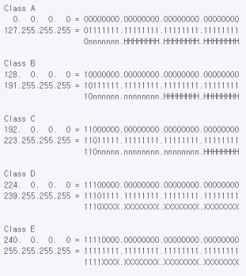
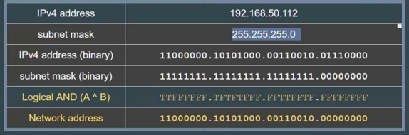

# 목차

1. [IP주소, MAC주소, ARP, RARP](#1-ip주소-mac주소-arp-rarp)
    1. [IP 주소](#1-ip-주소)
    2. [MAC 주소](#2-mac-주소)
    3. [ARP와 RARP](#3-arp와-rarp)
        1. [ARP의 과정](#arp의-과정)

2. [IP 주소 체계: IPv4와 IPv6](#2-ip-주소-체계-ipv4와-ipv6)
    1. [IPv4](#1-ipv4)
    2. [IPv6](#2-ipv6)
    3. [차이점](#차이점)
    4. [CRC](#crc)
    5. [IPv4와 IPv6 중 누가 더 빠를까?](#ipv4와-ipv6-중-누가-더-빠를까)

3. [클래스풀](#3-클래스풀)
    1. [정의](#1-정의)
    2. [클래스A](#클래스a)
    3. [클래스B](#클래스b)
    4. [클래스C](#클래스c)
    5. [왜 항상 주소 중 2개를 빼나요?](#왜-항상-주소-중-2개를-빼나요)
    6. [클래스풀의 문제점?](#클래스풀의-문제점)

4. [클래스리스와 서브넷마스크, 서브네팅](#4-클래스리스와-서브넷마스크-서브네팅)
    1. [클래스풀과 클래스리스 차이](#클래스풀과-클래스리스-차이)
        1. [클래스풀 네트워킹](#클래스풀-네트워킹)
        2. [클래스리스 네트워킹](#클래스리스-네트워킹)
    2. [서브넷 마스크](#서브넷-마스크)
    3. [10개의 사무실과 서브넷팅 예시](#10개의-사무실과-서브넷팅-예시)

5. [공인IP(public IP), 사설IP(private IP), NAT](#5-공인ippublic-ip-사설ipprivate-ip-nat)

# 1. IP주소, MAC주소, ARP, RARP

## 1. IP 주소

* 논리적 주소이며 컴퓨터 네트워크에서 장치들이 서로 인식하고 통신하기 위해서 사용하는 특수한 번호
* IP를 기반으로 통신한다고도 하지만 사실상 그 밑에 물리적인 주소인 MAC 주소를 통해 통신

## 2. MAC 주소

* 네트워크 인터페이스에 할당된 고유 식별자이며 보통 장치의 NIC(랜 카드)에 할당됨
* 48비트로 이루어져있으며 24비트의 OUI와 24비트의 UAA로 이루어짐
    * OUI: IEEE에서 할당한 제조사 코드
    * UAA: 제조사에서 구별되는 코드

## 3. ARP와 RARP

* IP address --> ARP --> MAC address
* IP address <-- RARP --< MAC address

### ARP의 과정

1. 해당 IP주소에 맞는 MAC 주소를 찾기 위해 해당 데이터를 "브로드캐스팅"을 통해 연결된 네트워크에 있는 장치에 모두 보낸다
2. 맞는 장치가 있다면 해당 장치는 보낸 장치에게 유니캐스트로 데이터를 전달해 주소를 찾는다

# 2. IP 주소 체계: IPv4와 IPv6

## 1. IPv4

* 32비트로 표현되는 주소체계
* 2^32개의 주소를 표현할 수 있음
* 8비트 단위로 점을 찍어 4개로 표현하며 보통 8비트를 10진수로 표현
* 이 주소 체계만으로는 부족하기 때문에 NAT, 서브네팅 등 여러 개의 부수적인 기술이 생겨남

## 2. IPv6

* 128비트로 표현되는 주소체계
* 많은 주소 처리 가능하며 NAT, 서브네팅이 필요하지 않음
* 16비트씩 8개로 구분하고 16비트는 16진수로 변환되어 콜론(:)으로 구분하여 표시하며 앞의 연속되는 0은 생략 가능
* 앞의 64비트는 네트워크 주소를 말하고, 뒤 64비트는 인터페이스 주소로 이루어져 있음

## 차이점

* IPv4는 체크섬이 있지만 IPv6는 체크섬이 없다
    * 상위 프로토콜(TCP, UDP)에 체크섬필드가 있기 때문에 헤더의 효율화를 위해 버전이 업그레이드되면서 사라짐
    * IPv6 + UDP 사용의 경우 UDP는 체크섬 필드가 없기 때문에 무조건 UDP 헤더의 체크섬필드를 사용해야한다고 설정해야 한다.
* IPv4는 헤더가 가변길이지만, IPv6는 고정길이(40바이트)라서 "인터넷 헤더길이"에 대한 정보가 없음
* IPv6에서 TTL은 HOP limit으로 대체됨

## CRC

* 순환중복검사로 네트워크상에서 데이터에 오류가 있는지 확인하기 위한 체크값을 결정하는 방식

# IPv4와 IPv6 중 누가 더 빠를까?

* IPv6가 주소 커버리지도 넓고 불필요한 헤더도 제거가 되어있기 때문에 더 좋다. 속도는 보통 IPv6가 빠르지만, IPv6가 사용하는 더 큰 패킷 크기로 인해 일부 사용 사례에서는 속도가 느려질 수 있음

# 3. 클래스풀

* IP주소는 인터넷 주소로 네트워크주소와 호스트주소 로 나뉨
    * 네트워크주소: 호스트들을 모은 네트워크
        * 네트워크주소가 동일 = 로컬네트워크
    * 호스트주소: 호스트를 구분하기 위한 주소
* 네트워크 호스트는 컴퓨터 네트워크에 연결된 컴퓨터나 기타 장치

## 1. 정의

* 네트워크 주소를 매기고 그에 따라 네트워크의 크기를 다르게 구분하여 클래스를 할당하는 주소체계
* 구분하는 기준자(1, 2, 3옥텟)를 서브넷마스크라고 함

### 클래스A

* 네트워크 주소 범위: 1 ~ 126 로 시작
* 원래는 127.255.255.255까지 포함하지만 127.X는 루프백 주소이기 대문에 포함하지 않음
* 0.0.0.0 도 특수주소로 포함하지 않음(알 수 없는 대상에 달아 놓는 임시 주소)

### 클래스B

* 네트워크 주소 범위: 128 ~ 191

### 클래스C

* 네트워크 주소 범위: 192 ~ 223

# 왜 항상 주소 중 2개를 빼나요?

* 맨 앞자리는 네트워크 주소로 남겨두며 마지막 주소는 브로드캐스팅 주소로 남겨 놓는다
* ex) 192.0.0.0 / 192.0.0.255

# 클래스풀의 문제점?

* 네트워크의 크기가 작은 경우 큰 네트워크를 필요로 하는 조직은 여러 개를 확보해야 함
* 작은 네트워크가 필요한 조직의 경우 너무 많은 IP를 가져가므로 IP가 낭비됨

# 4. 클래스리스와 서브넷마스크, 서브네팅

* 클래스리스: 클래스풀의 단점을 해결하기 위해 클래스로 나누는 것이 아닌 서브넷마스크를 중심으로 어디까지가 네트워크 주소고 어디까지가 호스트주소인지를 나눔
    * 서브네팅: 네트워크를 나눈다는 의미
    * 서브넷: 서브네트워크, 쪼개진 네트워크
    * 서브넷마스크: 서브네트워크를 위한 비트마스크
* 현대 주소체계는 클래스리스를 사용

## 클래스풀과 클래스리스 차이

### 클래스풀 네트워킹

* IP 주소를 A, B, C, D, E 클래스 기반으로 구분
* 각 클래스는 고정된 서브넷 마스크(FSM)를 가지고 있음
    * 클래스 A: 255.0.0.0
    * 클래스 B: 255.255.0.0
    * 클래스 C: 255.255.255.0
* 고정된 서브넷 마스크를 사용하여 네트워크와 호스트 부분을 나눔
* IP 주소의 첫 번째 옥텟에 따라 클래스가 결정됨
    * 클래스 A는 1-126
    * 클래스 B는 128-191
    * 클래스 C는 192-223

### 클래스리스 네트워킹

* 클래스 기반의 제한을 없앰
* 고정된 서브넷 마스크 대신 가변 길이 서브넷 마스크(VLSM)를 사용하여 네트워크와 호스트 부분을 동적으로 나눔
* CIDR 표기법을 사용하여 네트워크를 나타냄
    * 예: 192.168.0.0/22
* 더 유연하게 네트워크를 할당하고, 주소 낭비를 줄일 수 있음

## 서브넷 마스크

* 네트워크주소 부분만 모두 1, 호스트 주소부분은 0으로 설정해서 나눔
* 

## 10개의 사무실이 있으며 사무실당 12개의 장치를 연결해야 한다면?

* 예시 IP: 123.12.12.12/28
* 총 120개 필요
* 3번째 옥텟까지는 모두 1
* 11111111.11111111.11111111.00000000 = 2^8 = 256개
* 11111111.11111111.11111111.11110000 = 2^4 = 16개
* 하나의 네트워크당 n(여기서는 16)개의 호스트주소로 사용 가능하다
* 따라서 서브넷 마스크는 255.255.255.240

# 5. 공인IP(public IP), 사설IP(private IP), NAT

* IP 주소의 부족을 공인IP, 사설IP로 누나구, 중간에 NAT라는 기술을 통해 해결
* NAT(Network Address Translation)는 패킷이 트래픽 라우팅 장치를 통해 전송되는 동안 패킷의 IP주소를 변경, IP 주소를 다른 IP 주소로 매핑하는 방법
    * 내부 네트워크 IP가 노출되지 않는다는 장점이 있음