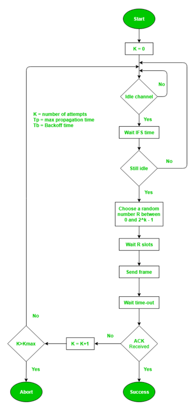

# 목차

1. [네트워크를 이루는 장치](#네트워크를-이루는-장치)
    1. [애플리케이션 계층](#애플리케이션-계층)
        - [L7 스위치](#l7-스위치)
        - [헬스체크](#헬스체크)
    2. [전송 계층](#전송-계층)
        - [L4 스위치](#l4-스위치)
    3. [인터넷 계층](#인터넷-계층)
        - [라우터](#라우터)
        - [L3 스위치](#l3-스위치)
    4. [데이터 링크 계층](#데이터-링크-계층)
        - [L2 스위치](#l2-스위치)
        - [브리지](#브리지)
    5. [물리 계층](#물리-계층)
        - [NIC(Network Interface Card)](#nicnetwork-interface-card)
        - [리피터](#리피터)
        - [AP(Access Point)](#apaccess-point)

2. [유선LAN #1: 전이중화 통신, CSMA/CD](#유선lan-1-전이중화-통신-csmacd)
    1. [전이중화 통신](#전이중화-통신)
    2. [CSMA/CD](#csmacd)

3. [유선LAN #2: 케이블](#유선lan-2-케이블)
    1. [트위스트페어 케이블](#트위스트페어-케이블)
    2. [광섬유 케이블](#광섬유-케이블)

4. [무선LAN #1: 반이중화 통신, CSMA/CA, 와이파이](#무선lan-1-반이중화-통신-csmaca-와이파이)
    1. [반이중화 통신(half duplex)](#반이중화-통신half-duplex)
    2. [CSMA/CA](#csmaca)
    3. [와이파이](#와이파이)

5. [무선LAN #2: 주파수와 2.4GHz와 5GHz의 차이](#무선lan-2-주파수와-24ghz와-5ghz의-차이)

6. [대규모 트래픽으로 인한 서버 과부하 해결방법 #1](#대규모-트래픽으로-인한-서버-과부하-해결방법-1)
    1. [모니터링을 통한 자원 할당](#모니터링을-통한-자원-할당)
    2. [로드밸런서](#로드밸런서)
    3. [블랙스완 프로토콜](#블랙스완-프로토콜)

7. [대규모 트래픽으로 인한 서버 과부하 해결방법 #2](#대규모-트래픽으로-인한-서버-과부하-해결방법-2)
    1. [서킷 브레이커](#서킷-브레이커)

8. [대규모 트래픽으로 인한 서버 과부하 해결방법 #3](#대규모-트래픽으로-인한-서버-과부하-해결방법-3)
    1. [컨텐츠 관리](#컨텐츠-관리)
        - [불필요한 컨텐츠 제거](#불필요한-컨텐츠-제거)
        - [CDN을 통한 컨텐츠 제공](#cdn을-통한-컨텐츠-제공)
        - [컨텐츠 캐싱](#컨텐츠-캐싱)
        - [컨텐츠 압축](#컨텐츠-압축)
        - [컨텐츠의 우아한 저하](#컨텐츠의-우아한-저하)

# 1. 네트워크를 이루는 장치

## 1. 애플리케이션 계층

### L7 스위치

* 로드밸런서라고 하며 서버의 부하를 분산하는 기기
* 서버 이중화, 보안에 강점이 있는 기기
* IP, Port뿐만이 아니라 url, 헤더, 쿠키 등을 기반으로 트래픽 분산
* "헬스체크"를 통해 장애가 발생한 서버를 확인하고 해당 서버로 트래픽을 보내지 못하게 함

### 헬스체크

* L4 스위치 또는 L7 스위치 모두 헬스 체크를 통해 정상적인 서버 또는 비정상적인 서버를 판별
* 전송 주기와 재전송 횟수 등을 설정한 이후 반복적으로 서버에 요청을 보내는 것
* 참고로 AWS에서 L4는 NLB, L7는 ALB를 통해 구축

## 2. 전송 계층

### L4 스위치

* 패킷의 IP 주소와 포트 번호를 참고해 적절히 트래픽 분산
* TCP, UDP 등의 헤더를 기반으로 우선순위를 판단해 분산 가능
* L7 스위치와 같이 헬스 체크 가능

## 3. 인터넷 계층

### 라우터

* 라우팅은 하나 이상의 네트워크에서 경로를 선택하는 프로세스
* 다른 네트워크에 존재하는 장치끼리 서로 데이터를 주고받을 때 “패킷소모 최소화”, “경로 최적화＂하는 장비

### L3 스위치

* L2 스위치의 기능 + 라우터 역할
* 라우팅테이블을 참조해 IP패킷에 IP주소를 담아 보냄

## 4. 데이터 링크 계층

* 데이터 링크 계층은 ‘이더넷 프레임’을 통해 에러 확인, 흐름 제어, 접근 제어를 담당
* 물리 계층은 무선 LAN과 유선LAN을 통해 0과 1로 이루어진 데이터를 보내는 계층

### L2 스위치

* 장치들의 MAC 주소를 MAC 주소 테이블을 통해 관리
* 인터넷계층에서 받은 패킷을 기반으로 이더넷프레임을 만들어 목적지의 MAC주소로 패킷을 보냄

### 브리지

* 두 개의 근거리 통신망(LAN)을 상호 접속할 수 있도록 하는 통신망 연결 장치
* 통신망의 범위를 확장하고 서로 다른 LAN을 기반으로 하나의 통신망을 구축

## 5. 물리 계층

### NIC(Network Interface Card)

* LAN 카드라고 함
* 네트워크에 연결하기 위해 PC에 설치된 회로기판
* 이 장치에는 PC 고유의 식별번호인 MAC주소가 있음

### 리피터

* 들어오는 약해진 신호 정도를 증폭하여 다른 쪽으로 전달하는 장치

### AP(access point)

* 패킷을 복사하는 장치
* AP에 유선 LAN을 연결한 후 무선 LAN기술을 기반으로 무선 네트워크망을 구축

# 2. 유선LAN #1. 전이중화 통신, CSMA/CD

* 전이중화(full duplex) 통신은 양쪽 장치가 동시에 송수신할 수 있는 방식
* 동축케이블, 광케이블 등을 기반으로 만들어진 유선LAN을 이루는 이더넷은 IEEE802.3 프로토콜을 기반으로 전이중화 통신을 사용

## 1. 전이중화 통신

* 양쪽장치가 동시에 송수신할 수 있는 방식
* 송신로와 수신로를 나눠서 데이터를 주고 받을 수 있음

## 2. CSMA/CD

* 이전에는 유선 LAN에 ‘반이중화 통신’ 중 하나인 CSMA/CD(Carrier Sense Multiple Access with Collision Detection) 방식 사용
    * 회선을 사용하는지를 파악한 후 사용하지 않는다면 데이터를 보내고 충돌이 발생한다면 일정 시간 이후 재전송하는 방식

# 3. 유선LAN #2. 케이블

## 1. 트위스트페어 케이블

* 실드처리를 한 케이블이 STP
* 안한 케이블이 UTP 케이블

### LAN 케이블

* 유선LAN을 구축할 때 쓰는 케이블인 LAN케이블은 UTP 케이블

## 2. 광섬유 케이블

* 레이저를 이용해 통신하며 보통 100Gbps의 데이터를 전송하는 케이블
* 빛의 굴절률이 높은 부분을 코어
* 낮은 부분을 클래딩
* 다른 밀도를 가지는 유리나 플라스틱 섬유를 기반으로 제작
* 한번 들어간 빛이 내부에서 계속해서 반사하며 전진하여 반대편 끝까지 가는 원리를 이용함

# 4. 무선LAN #1. 반이중화 통신, CSMA/CA, 와이파이

## 1. 반이중화 통신(half duplex)

* 양쪽 장치는 서로 통신할 수 있지만, 동시에는 통신할 수 없으며 한 번에 한 방향만 통신할 수 있는 방식

### CSMA/CA

* 반이중화 통신 중 하나로 장치에서 데이터를 보내기 전에 일련의 과정을 기반으로 사전에 가능한 한 충돌을 방지하는 방식
* 통신 과정

1. 사용중인 채널이 있다면 다른 채널을 감지하다 유후 상태인 채널을 발견
2. 프레임간 공간 시간인 IFS(InterFrame Space)시간만큼 기다림. IFS는 프레임의 우선순위를 정의할 때도 사용됨. IFS가 낮으면 우선순위가 높음
3. 프레임을 보내기 전 0~2^k - 1 사이에서 결정된 랜덤상수를 기반으로 결정된 시간만큼 기다린 뒤 프레임을 보냄
4. 프레임을 보낸 뒤 제대로 송신되었고 ACK 세그먼트를 받았다면 마침
5. 받지 못했다면 k = k+1을 하며 이 과정을 반복
6. 반복하다가 k가 정해진 Kmax 보다 더 커진다면 해당 프레임 전송을 버림(abort)
   

## 2. 무선 LAN의 대표적 기술

### 와이파이(wifi)

* 전자기기들이 무선 LAN 신호에 연결할 수 있게 하는 기술
* 근거리 무선망이라고도 할 수 있지만 근거리 무선망은 블루투스, 지그비 등도 있기 때문에 엄밀히 말하면 틀린 말
* 보통 유선 LAN을 AP 또는 공유기에 꽂아서 무선 LAN 신호를 만들어 구축

# 5. 무선LAN #2. 주파수와 2.4GHz 와 5GHz의 차이

* 무선 LAN(WLAN, Wireless Local Area Network)는 무선 신호 전달 방식을 이용하여 2대 이상의 장치를 연결하는 기술
* 비유도 매체인 공기에 주파수를 쏘아 무선 통신망을 구축하는데, 주파수 대역은 2.4GHz 대역 또는 5GHz 대역 중 하나를 사용해 구축
* 2.4GHz
    * 장애물에 강하나 속도가 더 느림
    * 호환성 좋음(오래된 노트북, 휴대폰과도 연결 가능)
    * 커버리지가 높음
* 5GHz
    * 장애물이 있을 때 연결이 끊기기도 하나 속도가 더 빠름
    * 호환성이 낮음
    * 커버리지가 작음

# DEEP DIVE: 대규모 트래픽으로 인한 서버 과부하 해결방법 #1

## 모니터링을 통한 자원 할당

* 서버 과부화로 서버가 응답 없음이 뜨는 것은 여러 가지 이유가 있지만 그 중 하나는 **"자원의 한계점 도달"**
* 보통 서버의 CPU 사용량이 80~90%에 도달하거나 메모리가 부족해 계속해서 스와핑이 발생하면 과부화 상태가 됨
* 이는 **모니터링을 통한 자원의 적절한 할당**으로 해결

### AWS 오토스케일링

* 서비스 이용 불가능 상태 발생 이전 cloud watch가 계속해서 모니터링하며 서버 대수를 늘려주는 방법
* AWS AutoScaling은 애플리케이션을 자동으로 모니터링하고 자원의 용량을 자동으로 조정

### netdata를 이용한 모니터링

* AWS를 사용하지 않으면 무료 모니터링 서비스 이용(https://github.com/netdata/netdata)
* slack과 연동으로 설정한 임계치를 기반으로 알림 서비스 구축

### 모니터링 이유

* 서버 과부화로 인해 서버 중지에 대한 대처 가능

1. 어떤 페이지에서 어떤 트래픽이 얼마나 발생했는지
2. 어떤 네트워크에서 병목 현상이 일어났는지 등

* 활용도가 낮은 페이지, 높은 페이지 파악해 서비스 개선

## 로드밸런서

* AWS 오토스케일링은 빠르긴 하나 구성에 시간이 걸리기 때문에 앞단에 로드밸런서를 통해 트래픽 분산
* 한 서버에 장애가 발생하면 로드 밸런서는 트래픽을 다른 기능 서버로 리디렉션하여 시스템 중단을 방지

## 블랙스완 프로토콜

* 블랙스완: 예측할 수 없는 사고가 일어난 것
* 사후에는 이 사고의 원인 등을 분석할 수 있지만 사전에는 이 사고를 예측할 수 없는 것
* 구글의 블랙스완 프로토콜

1. 영향을 받은 시스템과 각 시스템의 상대적 위험 수준을 확인
    * 체계적으로 데이터를 수집하고 원인에 대한 가설을 수립한 후 이를 테스팅
2. 잠재적으로 영향을 받을 수 있는 내부의 모든 팀에 연락
3. 최대한 빨리 취약점에 영향을 받는 모든 시스템을 업데이트
4. 복원 계획을 포함한 우리의 대응 과정을 파트너와 고객 등 외부에 전달

# DEEP DIVE: 대규모 트래픽으로 인한 서버 과부하 해결방법 #2

## 서킷 브레이커

* 서비스 장애를 감지하고 연쇄적으로 생기는 에러를 방지하는 기법
* 서비스와 서비스 사이에 서킷브레이커 계층을 두고 미리 설정해놓은 timeout 임계값에 도달하면 서킷브레이커가 그 이후의 추가호출에 무조건 에러를 반환하게 함
* 연쇄적인 오류 전파를 끝내는 역할

### 필요 사례1: 스레드의 차단

* 하나의 스레드가 차단되는 것은 괜찮으나,
* 예를 들어 100개의 스레드가 있고 그 중 98개의 요청이 에러가 있는 서비스에 요청을 한다면 나머지 2개의 요청은 차단

### 필요 사례2: 계단식 실패 발생

* 하나 이상의 부품, 서비스 등의 고장이 연결되어있는 다른 부품, 서비스의 고장으로 이어지는 것

### 사용자 입장에서 응답 대기

* 사용자 입장에서 응답을 오래 기다리는 것은 좋은 UX가 아님
* 성공인지 실패인지 중요한 게 아니라 중요한 것은 **사용자가 기다리지 않아야 한다**

### 서킷브레이커의 상태

* closed(정상)
    * 네트워크 요청의 실패율이 임계치보다 낮음
* open(에러)
    * 임계치 이상의 상태
    * 요청을 서비스로 전송하지 않고 바로 오류를 반환
    * fail fast 라고 함
* half_open(확인중)
    * open 상태에서 일정 timeout으로 설정된 시간이 지나면 장애가 해결되었는지 확인하기 위해 half_open 상태로 전환
    * 여기서 요청을 전송하여 응답을 확인
    * 장애가 풀리는지를 확인해서 성공하면 closed, 실패하면 다시 open으로 변경

### 서킷브레이커의 장점

* 연속적인 에러 발생을 막아주며 일부 서비스가 종료되더라도 다른 서비스들은 이상없이 동작하게 만들 수 있으며 사용자 경험을 높여줌

### 서킷브레이커 라이브러리

* resilience4j
    * https://github.com/resilience4j/resilience4j

# DEEP DIVE: 대규모 트래픽으로 인한 서버 과부하 해결방법 #3

## 컨텐츠 관리

### 1. 불필요한 컨텐츠 제거

* 불필요한 쿼리 제거하거나 최적화하기

### 2. CDN을 통한 컨텐츠 제공

* CDN을 통해 사용자 가까이, 그리고 분산된 대규모 서버 네트워크를 기반으로 컨텐츠를 제공해서 메인 서버에 대한 부하를 줄임

### 3. 컨텐츠 캐싱

* 네트워크 트래픽을 해결하는 가장 좋은 방법은 해당 트래픽이 발생하지 않도록 하는 것
* 브라우저 캐시(쿠키, 로컬저장소, 세션저장소)를 통해 해당 요청에 관한 항목을 캐시에서 응답을 읽어 네트워크 요청에 관한 비용을 모두 제거

### 4. 컨텐츠 압축

* 텍스트 기반 리소스는 gzip 또는 Brotli를 통해 압축
* 압축하면 70% 정도 까지 압축 가능
* 다만 압축을 풀기 위해 서버에서 자원(CPU)를 사용하는 양까지 고려해야 함. 보통은 압축하면 좋음

### 5. 컨텐츠의 우아한 저하(미리 준비된 응답)

* 제공하는 컨텐츠 및 기능을 일시적으로 줄이는 전략
* 정적 텍스트 페이지를 제공
* 검색을 비활성화
* 더 적은 수의 검색 결과를 반환
* 필수적이지 않은 기능을 비활성화