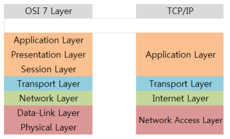
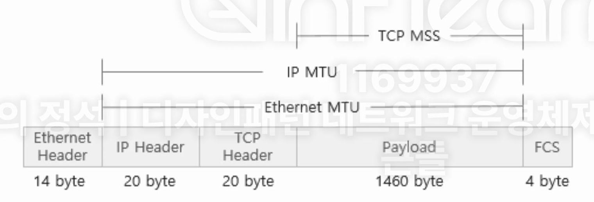
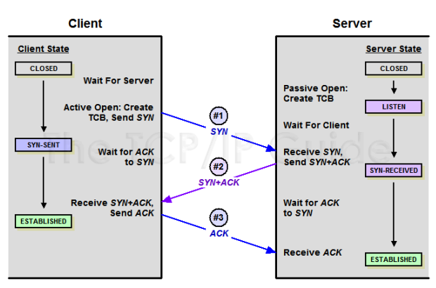
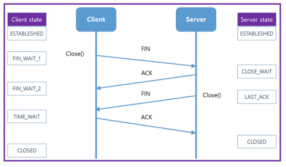

# 1. TCP/IP 4계층(1)

* 장치들이 인터넷상에서 데이터를 주고받을 때 쓰는 독립적인 프로토콜의 집합
* TCP(Transmission Control Protocol) / IP(Internet Protocol)이라는 의미
* 인터넷을 통해 데이터를 보낼 때 주로 TCP와 IP를 이용해서 보낸다

## 1. 개념

### 1. 애플리케이션 계층(application)

* HTTP, SMTP, SSH, FTP가 대표적
* 웹서비스, 이메일 등 서비스를 실질적으로 사람들에게 제공하는 층

### 2. 전송 계층(transport)

* TCP, UDP가 대표적
* 애플리케이션에서 받은 메시지를 기반으로 세그먼트 또는 데이터그램으로 데이터를 쪼개고 데이터 오류없이 순서대로 전달되도록 도움을 주는 층

### 3. 인터넷 계층(network)

* IP, ICMP, ARP가 대표적
* 한 노드에서 다른 노드로 전송 계층에서 받은 세그먼트 또는 데이터그램을 패킷화하여 목적지로 전송하는 역할을 담당

### 4. 링크 계층(link)

* 전선, 광섬유, 무선 등으로 데이터가 네트워크를 통해 물리적으로 전성되는 방식
* 데이터링크 계층과 물리 계층을 합친 계층

## 2. 캡슐화와 비캡슐화

### 1. 캡슐화

* 송신자가 수신자에게 데이터를 보낼 때 데이터가 각 계층을 지나며 각 계층의 특징들이 담긴 헤더들이 붙여지는 과정
* ex) 전송 계층은 TCP 헤더, 네트워크 계층은 IP 주소 헤더를 추가

### 2. 비캡슐화

* 캡슐화의 역과정
* 수신자측에서 캡슐화된 데이터를 역순으로 제거하면서 응용계층까지 도달하는 것

## 3. PDU

* Protocol Data Unit
* 각 계층의 데이터 단위
    * 애플리케이션 계층: 메시지
    * 전송 계층: 세그먼트(TCP), 데이터그램(UDP)
    * 인터넷 계층: 패킷
    * 링크 계층: 프레임(데이터 링크 계층), 비트(물리 계층)
* 세그먼트: 적절한 크기로 쪼갠 조각
* 패킷: 세그먼트에 SP(Source)와 DP(Destination)가 포함된 IP 헤더가 붙은 형태의 조각
* 프레임: MAC주소 헤더와 CRC(데이터 전송오류 감지)/체크섬(데이터 무결성) 트레일러가 붙은 조각

## 4. OSI 7계층

* OSI 7계층과 TCP/IP 4계층의 차이를 알아두자
  

# 2. TCP/IP 4계층(2)

## 1. MTU

* MTU(Maximum Transmission Unit)는 네트워크에 연결된 장치가 받아들일 수 있는 최대 데이터 패킷의 크기
* 이 크기를 기준으로 데이터는 쪼개져서 패킷화함
* 네트워크 경로 상에 있는 아무 장치는 MTU보다 패킷이크면 그 패킷은 분할될 수도 있음

### 패킷이 분할되지 않는 경우

* 패킷을 분할할 수 없어 네트워크 경로 상에 있는 어떠한 라우터나 장치의 MTU를 초과할 때 분할해서 전달하는 것이 아니라 전달을 아예 하지 않을 수 있음
* IPv6는 분할을 허용하지 않음
* IPv4 헤더에는 flags라는 필드가 있는데 여기서 bit이 1이 되면 "Don't Fragment" 플래그가 활성화된다라는 의미
    * 이때 분할 불가능

## 2. MSS

* MSS(Maximum Segment Size)는 TCP에서 사용할 수 있는 데이터의 크기이자 TCP 헤더, IP 헤더를 뺀 크기
* 일반적으로 MTU는 1500바이트, MSS는 1460바이트
* 그렇기 때문에 MTU가 1500이라도 데이터는 보통 1460 이하의 크기로 보내야 전달이 됨
  

## 3. PMTUD

* PMTUD(Path MTU Discovery)는 수신자와 송신자의 경로 상에서 장치가 패킷을 누락한 경우 테스트 패킷의 크기를 낮추면서 MTU에 맞게끔 반복해서 보내는 과정

# 3. TCP/IP 4계층(3) - 애플리케이션 계층

## 1. HTTP

* HTTP(Hypertext Transfer Protocol)은 처음에는 서버와 브라어주간에 데이터를 주고 받기 위해 설계된 프로토콜
* 지금은 브라우저뿐만 아니라 서버와 서버간의 통신할 때도 많이 이용

### 1. HTTP는 헤더를 통한 확장이 쉽다

* 헤더값에다가 어떤 값을 넣어서 HTTP요청을 할 때 쉽게 다른 값을 추가할 수 있음

### 2. stateless하다

* 동일한 연결에서 연속적으로 수행되는 두 요청 사이에 연속적인 상태(state)값은 없음

## 2. SSH

* SSH(Secure Shell Protocol)는 보안되지 않은 네트워크에서 네트워크 서비스를 안전하게 운영하기 위함 암호화 네트워크 프로토콜
* 보통 프라이빗 키가 있는 경로에서 이런 식으로 키를 명시하고 실행

```
ssh <pem> <user>@<serverIP>
```

* 접근해서 리눅스 명령어를 통해 CLI 환경에서 작업을 진행

## 3. FTP

* FTP(File Transfer Protocol)는 노드와 노드간의 파일을 전송하는 사용되는 프로토콜
* 지금은 파일을 암호화해서 전송하는 FTPS 또는 SFTP로 대체되고 있음

## 4. SMTP

* SMTP(Simple Mail Transfer Protocol)은 인터넷을 통해 메일을 보낼 때 사용되는 프로토콜
* 보통 서비스를 운영하면 메일링 서비스를 할 때 사용

# 4. TCP/IP 4계층(4) - 전송 계층

## 1. TCP

* 가상회선 패킷 교환방식
    * 가상회선을 만들어서 패킷을 순서대로 전송
* 오류검사 매커니즘
    1. 재전송: 시간 초과 기간이 지나면 서버는 전달되지 않은 데이터에 대해 재전송을 시도
    2. 체크섬: 체크섬: 무결성 평가. 즉, 송신된 데이터의 체크섬과 수신된 데이터의 체크섬 값을 비교해 올바르게 왔는지를 확인
* 헤더
    * 20~60 바이트로 가변적

## 2. UDP

* 데이터그램 패킷 교환방식
    * 순서 보장하지 않음
* 오류 검사는 단순한 체크섬만 지원
* 헤더
    * 8바이트로 고정

## ! TCP와 UDP 차이점 비교

|              | 전송 제어 프로토콜(TCP)                                             | 데이터그램 프로토콜(UDP)                                     |
|--------------|-------------------------------------------------------------|-----------------------------------------------------|
| **패킷교환방식**   | 가상회선 패킷 교환방식                                                | 데이터그램 패킷 교환방식                                       |
| **신뢰성**      | O                                                           | X                                                   |
| **오류검사**     | 재전송, 체크섬                                                    | 체크섬                                                 |
| **패킷의 순서보장** | O                                                           | X                                                   |
| **헤더 길이**    | (20-60)바이트 가변 길이                                            | 8바이트 고정 길이                                          |
| **연결보장**     | 연결을 보장함. 3웨이 - 핸드셰이크로 연결을 맺고 4 - 웨이 핸드셰이크로 연결을 해제하는 작업이 필요. | 연결을 보장하지 않음. 그냥 데이터를 보냄. 연결을 유지하고 해제하는 데 드는 비용이 없음. |
| **브로드캐스트지원** | X                                                           | O                                                   |
| **속도**       | 느림                                                          | 빠름                                                  |

# 5. TCP/IP 4계층(4) - 인터넷 계층

## 1. 인터넷 계층

* IP, ICMP, ARP가 대표적
* 한 노드에서 다른 노드로 전송 계층에서 받은 세그먼트 또는 데이터그램을 패킷화하여 전송

## 2. ICMP

* Internet Control Message Protocol 은 노드와 노드 사이에서 통신이 잘되나를 확인할 때 쓰는 프로토콜
* 데이터를 교환하는데 사용되지 않는 프로토콜
* 테스팅에 사용
* IP와는 달리 TCP 또는 UDP와 같은 전송 계층 프로토콜과 연관되지 않고 독립적인 비연결형 프로토콜

# 6. TCP의 연결 성립: 3웨이 핸드셰이크

## 1. SYN 단계

* 클라이언트는 서버에 클라이언트의 ISN을 담아 SYN을 보냄

## 2. SYN + ACK 단계

* 서버는 클라이언트의 SYN을 수신하고 서버의 ISN을 보내며 승인번호로 클라이언트의 ISN+1을 보냄

## 3. ACK 단계

* 클라이언트는 서버의 ISN+1한 값인 승인번호를 담아 ACK를 서버에 보냄

### ISN

* TCP 기반 통신에서 각각의 새 연결에 할당된 고유한 32비트 시퀀스 번호
* TCP 연결을 통해 전송되는 다른 데이터 바이트와 충돌하지 않는 시퀀스 번호를 할당하는데 도움

## 4. 클라이언트와 서버의 상태



* TCP 연결을 하면서
    * 클라이언트
        * closed, syn-sent, established
    * 서버
        * closed, listen, syn-received, established
* 상태가 된다
* 이러한 서버와 클라이언트간의 연결 설정 과정이 있기 때문에 TCP는 신뢰성이 있다고 하며
* 이러한 과정이 없는 UDP는 신뢰성이 없다고 한다

### listen

* 서버가 클라이언트의 연락을 기다리는 상태, 이를 기반으로 서버 메서드의 이름이 결정됨

# 7. TCP의 연결 해제: 4웨이 핸드셰이크와 TIME_WAIT

## 연결 해제 과정



1. **클라이언트**: 연결을 닫으려고 할 때 **FIN**으로 설정된 세그먼트를 보냄   
   **FIN_WAIT_1** 상태로 들어가고 서버의 응답을 기다림
2. **서버**: **ACK**라는 승인 세그먼트를 보내고 **CLOSE_WAIT** 상태에 들어감   
   **클라이언트**: 세그먼트를 받으면 **FIN_WAIT_2** 상태에 들어감
3. **서버**: **LAST_ACK** 상태가 되며 일정 시간 이후에 **FIN** 세그먼트를 보냄
4. **클라이언트**: **TIME_WAIT** 상태가 되고 다시 **ACK**를 보내서 **서버**는 **CLOSE** 상태가 됨   
   이후 **클라이언트**: 어느 정도의 시간(TIME_WAIT으로 설정된 시간)을 대기한 후 연결 **CLOSE**

### TIME_WAIT

* **지연 패킷** 등이 발생했을 때 데이터 무결성을 해결하기 위해 패킷을 기다리는 시간
* 연결이 올바르게 닫힌 상태로 만들기 위해 존재하기도 함