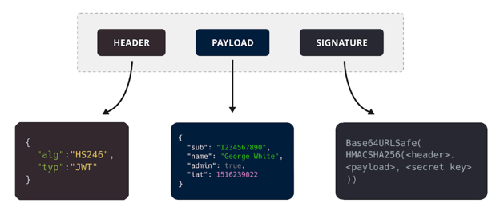

# 1. 세션 기반 인증 방식

* 로그인은 세션 기반 인증 방식 또는 토큰 기반 인증 방식으로 구현
* HTTP의 특징 중 상태없음(stateless)으로 인해 HTTP 요청으로 데이터르 ㄹ주고 받을 때 요청이 끝나면 요청한 사용자의 정보 등을 유지하지 않는 특징이 있음
* 그렇기에 로그인 상태를 어떻게 유지하느냐? 에 대한 질문이 생김
    * 로그인은 로그인한 상태값이 남아있어야 하기 때문

## 세션 기반 로그인 프로세스

1. 처음 로그인 >> 세션ID 생성 >> 서버에서 세션ID를 쿠키로 설정해 클라이언트에 전달 + DB에 세션ID 저장
2. 클라이언트가 서버에 요청을 보낼 때 해당 세션ID를 쿠키로 담아 전에 로그인했던 아이디인지 확인
3. 로그인 유지

### 단점

1. 사용자의 상태에 관한 데이터를 서버에 저장했을 때 로그인 유저의 수가 늘어난다면 서버의 메모리 과부하가 올 수 있음
2. DB 중 RDBMS에 저장한다면 직렬화 및 역직렬화에 관한 오버헤드 발생

## 2. 토큰 기반 인증 방식

* state를 모두 토큰 자체만으로 처리하며 토큰을 처리하는 한 서버를 두고 다른 컨텐츠를 제공하는 서버는 모두 stateless하게 만든다

### 토큰을 관리하는 서버는 왜 따로 두어야 할까?

* 여러 서버를 운용한다고 했을 때 토큰 기반 인증 + A 도메인을 처리하는 서버로 구축할 경우, A 도메인에서 에러가 발생하면 인증에 관한 기능이 마비되고 이는 B, C, D 등의 도메인 기능이 연쇄적으로 마비될
  수 있기 대문

## 토큰 기반 로그인 프로세스

1. 로그인 >> 인증 로직 >> JWT 토큰 생성(access 토큰, refresh 토큰)
2. 사용자가 이후에 access 토큰을 HTTP Header - Authorization 또는 HTTP Header - Cookie에 담아 인증이 필요한 서버에 요청해 원하는 컨텐츠를 가져옴

## JWT

* Json Web Token을 의미하며 헤더, 페이로드, 서명으로 이루어짐
* JSON 객체로 인코딩되며 메시지 인증, 암호화에 사용
  
* Header
    * 토큰 유형과 서명 알고리즘(alg, typ)
    * base64URI로 인코딩
* Payload
    * **데이터**, 토큰 발급자, 토큰 유효기간
    * base64URI로 인코딩
* Signature
    * (인코딩된 header + payload) + 비밀키를 기반으로 헤더에 명시된 알고리즘으로 다시 생성한 서명값

### 장점

1. 사용자 인증에 필요한 모든 정보는 토큰 자체에 포함하기 때문에 **별도의 인증 저장소가 필요 없음**
2. 다른 유형의 토큰과 비교했을 때 **경량화**되어있음
3. 디코딩했을 때 JSON이 나오기 때문에 JSON을 기반으로 쉽게 직렬화, 역직렬화가 가능

### 단점

1. 토큰이 비대해질 경우 당연히 서버과부하에 영향
2. 토큰 탈취당할 경우 디코딩했을 때 데이터를 볼 수 있음

### AccessToken

* 사용자 인증 확인
* 탈취당했을 때를 예방하고자 수명 짧게

### RefreshToken

* accessToken이 만료되었을 때 다시 access 토큰을 얻기 위해 사용되는 토큰

### 사용시 주의할 점

* Bearer <token> 으로 Bearer 을 앞에 둬서 토큰기반인증방식이라는 것을 알려주어야 함
* https 사용
* 쿠키에 저장한다면 sameSite: 'Strict' 사용
* 수명이 짧은 access token을 발급
* url에 토큰을 전달하지 않음

### 토큰 탈취당하는 것을 대비하는 방법
1. Access Token의 수명을 짧게 설정하고, 필요할 때만 Refresh Token을 통해 새로운 Access Token을 발급
2. Refresh Token을 사용해 민감한 작업을 수행하려고 할 때 추가적인 사용자 인증 단계를 요구해야 함.
   * 예를 들어, IP 주소, 디바이스 정보 등을 이용하거나 google authenticator를 이용한 2단계 인증을 사용
3. 쿠키에 HttpOnly 및 Secure 을 걸어서 관리
### 현업에서의 토큰 및 쿠키
* 어떤 사이트가 어떤 인증방식을 사용하는지 명확하게 알 방법은 없음
* 그러나 보통 토큰기반 인증방식을 사용한다면 해당 토큰값의 네이밍을 접두사가 "token" 또는 "bearer"로 시작하는 경우가 있거나 토큰 이름을 token이라는 것을 넣어서 해당 사이트가 토큰기반 인증방식임을 유추할 수 있음
  * Reddit, velog : 토큰 기반 - 쿠키에 저장하며 HTTP only, secure 옵션이 걸려 있음
  * naver, daum, github : 세션 기반 - 쿠키에 저장
* 로그인 정보를 쿠키에 담아 보관할 때 네이밍을 흔한 session_id, access_token 등을 쓰지 않고 기업 내에서 정한 이름을 바탕으로 관리하며 쿠키를 나눠서 관리하는 사례도 확인