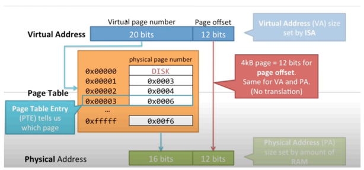

# 1. 캐시히트와 캐시미스

## 캐시

* 데이터를 미리 복사해놓는 임시 저장소이자 빠른 장치와 느린 장치에서 속도 차이에 따른 병목 현상을 줄이기 위한 메모리
* 데이터 접근 시간의 단축, 데이터를 다시 계산하는 시간 등을 절약
* 대표적 예: CPU 레지스터
    * CPU가 메모리로부터 데이터를 가져올 때의 시간이 너무나 크기 때문에 그 중간에 레지스터 계층을 둬서 속도 차이를 해결
* 캐시 히트
    * 캐시에서 원하는 데이털르 찾은 것
* 캐시 미스
    * 캐시에서 원한느 데이터를 찾지 못한 것
    * 캐시 미스가 일어나면 메모리로 가서 원하는 데이터를 레지스터에 등록하게 됨

## 캐시 - 지역성의 원리

* 캐시를 설정할 때는 자주 사용하는데이터를 기반으로 설정해야 함
* 시간 지역성(temporal locality)
* 공간 지역성(spatial locality)

### 시간 지역성

* 최근 사용한 데이터에 다시 접근하려는 특성

### 공간 지역성

* 최근 접근한 데이터를 이루고 있는 공간이나 그 가까운 공간에 접근하는 특성

# 2. 캐시매핑: 직접매핑, 연관매핑, 집합 - 연관매핑(To-be)

* 캐시의 크기는 메모리보다 항상 작기 때문에 효율적으로 매핑하는 것이 중요함

## 직접매핑

* direct mapping 이란 메모리의 특정 블록은 특정 캐시 라인에만 매핑할 수 있는 것
* 메모리가 A개의 페이지, 캐시가 B개의 페이지로 구성된다고 했을 때 메모리의 페이지 수 A를 B개로 나눔
* 메모리의 페이지 수는 B * 블록 수 가 됨
* 메모리가 1~100 / 캐시가 1~5 라면 1:1~20, 2:21~40 ... 이런 식으로 매핑
* 운영체제는 메모리를 똑같은 크기의 페이지(보통 4kb)로 나눠서 관리하며 <P, D>로 나누어 관리
    * P(Page Number)는 페이지 번호
    * D(Page offset)는 페이지 번호로부터 해당 주소까지의 거리
      
* 그림과 같이 가상주손느 20bits로 주소를 관리하기 때문에 더 많은 주소를 할당하는 것으로 볼 수 있으며, 이러한 주소가 16bits의 실제 주소로 페이지 테이블을 통해 변환된느 ㄱ것을 볼 수 잇음
* 여기서 D(page offset)는 변환되지 않고, **변환되는 것은 P(Page Number)** 임
* 즉, 매핑되는 부분은 P이기 때문에 P만을 보면 되는데 P를 직접매핑에서는 {tag, bd}로 세분화해서 직접매핑을 구현
  * bd(block distance), 블럭을 위한 태그를 기반으로 <tag, bd, D> 로 세분화하여 bd가 같은 라인만 매핑이 되게 함
* 이를 통해 해당 블록만 확인하면 되서 처리가 빠른 장점이 있지만 스와핑이 빈번하게 발생할 수 있음

## 연관매핑
* associative mapping 이란 순서를 일치시키지 않고 관련있는 캐시와 메모리를 매핑하며 메모리의 컨텐츠가 캐시의 어느 위치에도 올라갈 수 있는 방법
* 스와피잉 덜 일어나겠지만 캐시의 모든 블록을 탐색해야 해서 속도가 직접매핑보다 느림
* bd와 tag를 합한 P로 설명

## 집합 연관매핑
* set associate mapping 은 집합을 나누고(정해진 집합을 만들다 - 직접매핑) 해당 집합에는 bd만 같으면 들어올 수 있게 하는데 이때 어떤 블럭에도 들어올 수 있게 하는 것
* 모든 블럭을 찾을 필요 없이 특정 블럭을 찾게 해 탐색비용을 낮춘 직접매핑의 장점과 스와핑을 완화시키는 연관매핑의 장점을 모두 지니게 됨
* 예를 들어, 다음과 같이 캐시에서 bd가 0인 집합을 2개로 나누고 bd가 같은 것만 들어올 수 있게 하는 것
* bd가 많지만 bd를 0 또는 1밖에 없게 하고 집합을 2개로 나눔
* bd가 0인 것이 2개가 들어갈 수 있게, 1인게 2개가 들어갈 수 있게 나눈 것 