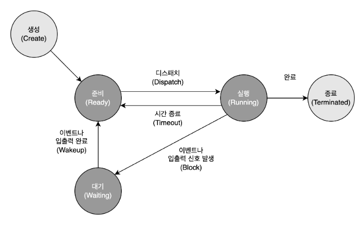
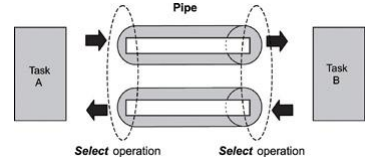
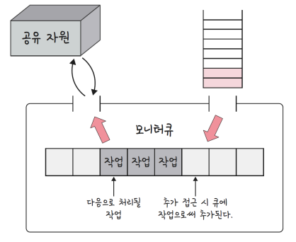

# 목차

1. [프로세스와 스레드](#프로세스와-스레드)
    - [프로세스](#프로세스process)
    - [스레드](#스레드thread)
    - [프로세스와 스레드의 차이](#프로세스와-스레드의-차이)
2. [프로그램의 컴파일 과정](#프로그램의-컴파일-과정)
3. [프로세스의 메모리 구조](#프로세스의-메모리-구조)
    - [정적 할당](#정적-할당)
    - [동적 할당](#동적-할당)
4. [PCB와 컨텍스트 스위칭](#pcb와-컨텍스트-스위칭)
    - [PCB의 구조](#pcb의-구조)
    - [컨텍스트 스위칭](#컨텍스트-스위칭)
5. [프로세스의 상태](#프로세스의-상태)
6. [멀티 프로세싱과 멀티 스레딩](#멀티-프로세싱과-멀티-스레딩)
7. [IPC](#ipc)
    - [공유 메모리](#공유-메모리)
    - [파일](#파일)
    - [소켓](#소켓)
    - [파이프](#파이프)
    - [메시지 큐](#메시지-큐)
8. [공유 자원, 경쟁 상태, 임계 영역](#공유-자원-경쟁-상태-임계-영역)
9. [뮤텍스, 세마포어, 모니터](#뮤텍스-세마포어-모니터)
    - [뮤텍스](#뮤텍스)
    - [세마포어](#세마포어)
    - [모니터](#모니터)
10. [교착 상태](#교착-상태deadlock)
    - [교착 상태의 원인](#교착-상태의-원인)
    - [교착 상태 해결 방법](#교착-상태-해결-방법)
    - [은행원 알고리즘](#은행원-알고리즘)

# 프로세스와 스레드

## 프로세스(Process)

* 메모리에 올라와 실행되고 있는 프로그램
* task와 같은 의미
* 하나의 스레드로 이루어진 싱글스레드 프로세스, 여러 개의 스레드로 이루어진 멀티스레드 프로세스로 나뉨

## 스레드(Thread)

* 프로세스 내 작업의 흐름

## 프로세스와 스레드의 차이

1. 메모리
    * 프로세스는 **코드, 데이터, 스택, 힙** 메모리 영역을 기반으로 작업하는 반면, 스레드는 프로세스 내의 **스택** 메모리를 제외한 다른 메모리 영역을 프로세스 내의 다른 스레드들과 공유하기 때문에 *
      *메모리적 이점**이 있음
2. 격리성
    * 프로세스는 다른 프로세스와 격리되어있기 때문에 서로 통신을 하기 위해서는 IPC를 사용해야 하지만, 스레드는 다른 스레드와 서로 격리되어있지 않으므로 그냥 통신할 수 있어 프로세스보다 빠름
3. 영향
    * 프로세스는 한 프로세스에 문제가 생겨도 다른 프로세스에 영향을 끼치지 않지만, 스레드는 격리가 되어있지 않아 한 스레드에 문제가 생기면 다른 스레드에도 영향을 끼쳐 스레드로 이루어져 있는 프로세스에 영향을
      줄 수 있음
4. 시간
    * 프로세스는 생성과 종료에 더 많은 시간이 들지만, 스레드는 더 적은 시간이 듬

# 프로그램의 컴파일 과정

1. 전처리
    * 소스코드의 주석 제거, #include 등 헤더 파일을 병합하고 매크로를 치환
2. 컴파일러
    * 오류 처리, 코드 최적화 작업을 하여 어셈블리어로 변환
3. 어셈블리어
    * 목적 코드(object code)로 변환
    * 이때 확장자는 운영체제마다 다른데 리눅스에서는 .o
4. 링커
    * 프로그램 내 있는 라이브러리 함수 등과 결합해 실행 파일이 만들어짐
    * .exe, .out 확장자를 갖게 됨

# 프로세스의 메모리 구조

* 스택
    * 지역변수, 매개변수, 함수가 저장되고 컴파일시 크기가 결정됨
    * 그러나 함수가 함수를 호출하는 등에 따라 런타임시에도 크기가 변경됨
    * 동적인 특징
* 힙
    * 동적 할당할 때 사용되며 런타임시 크기가 결정됨
    * 동적인 특징
* 데이터 영역
    * BSS 영역과 Data 영역으로 나뉨
    * 정적 할당에 관한 부분을 담당
    * 정적인 특징
* 코드 영역
    * 소스 코드가 들어감
    * 정적인 특징

## 정적 할당

* 컴파일 단계에서 메모리를 할당하는 것
* BSS segment 와 Data segment, Code / Text segment 로 나뉘어서 저장

### BSS segment

* 전역 변수, static, const로 선언되어있는 변수 중 **0으로 초기화** 또는 **초기화가 어떠한 값으로도 되어 있지 않은 변수**들이 이 메모리 영역에 할당됨

### Data segment

* 전역 변수, static, const로 선언되어있는 변수 중 **0이 아닌 값**으로 초기화된 변수가 이 메모리 영역에 할당됨

### Code / Text segment

* 프로그램의 코드

## 동적 할당

* 런타임 단계에서 메모리를 할당받는 것
* Stack 과 Heap으로 나뉨

### Stack

* 지역 변수, 매개 변수, 실행되는 함수에 의해 늘어나거나 줄어드는 메모리 영역
* 함수가 호출될 때마다 호출될 때의 환경 등 특정 정보가 stack에 계속해서 저장됨
* 참고로, 재귀함수가 호출된다고 했을 때 새로운 스택 프레임이 매번 사용되기 때문에 함수 내의 변수 집합이 해당 함수의 다른 인스턴스 변수를 방해하지 않음

### Heap

* 동적으로 할당되는 변수들을 담음
* malloc(), free() 함수를 통해 관리할 수 있음
* 동적으로 관리되는 자료구조의 경우 Heap 영역을 사용함
* 예를 들어, vector는 내부적으로 Heap 영역 사용

# PCB와 컨텍스트 스위칭

* PCB(Process Control Block)는 운영체제에서 관리하는 프로세스에 대한 메타데이터를 저장한 데이터블록
* 커널 스택에 저장되며 각 프로세스가 생성될 때마다 고유의 PCB가 생성이 되고 프로세스가 종료되면 PCB는 제거됨

## PCB의 구조

* 프로세스 상태 – 대기중, 실행 중 등 프로세스의 상태
* 프로세스 번호(PID) – 각 프로세스의 고유 식별 번호(프로세스 ID)
* 프로그램 카운터(PC) – 이 프로세스에 대해 실행될 다음 명령의 주소에 대한 포인터
* 레지스터 – 레지스터 관련 정보
* 메모리 제한 – 프로세스의 메모리 관련 정보
* 열린 파일 정보 - 프로세스를 위해 열린 파일 목록들

## 컨텍스트 스위칭

* PCB를 기반으로 프로ㅔㅅ스의 상태를 저장하고 다시 복원시키는 과정
* 프로세스가 종료되거나 인터럽트에 의해 발생됨

### 컨텍스트 스위칭의 비용

1. 유휴시간의 발생
    * 컨텍스트 스위칭을 할 때마다 프로세스당 유휴 시간이 발생
2. 캐시 미스
    * 프로세스가 가지고 있는 메모리 주소가 그대로 있으면 잘못된 주소 변환이 생기므로 캐시클리어 과정이 무조건 일어나게 되고 이때문에 캐시미스가 발생
3. 오버헤드
    * CPU는 중단된 작업의 상태(레지스터, 프로그램 카운터, 메모리 매핑 등)를 저장하고, 새 작업의 상태를 로드해야 함
    * 이때 일정한 오버헤드가 발생하게 되며 이 오버헤드가 자주 발생하면 전체적으로 시스템 성능이 저하될 수 있으며, CPU의 유효 가동 시간에 영향을 미칠 수 있음

### 스레드에서의 컨텍스트 스위칭

* 스레드는 스택 영역을 제외한 모든 메모리를 공유하기 때문에 비용이 더 적고 시간도 더 적게 든다는 장점이 있음

# 프로세스의 상태

## 1. 생성 상태

* create or new 는 프로세스가 생성된 상태를 의미
* fork() 또는 exec() 함수를 통해 프로세스가 생성된 상태
* 이때 PCB가 할당됨

### fork()

* 부모 프로세스의 주소 공간을 그대로 복사하며, 새로운 자식 프로세스를 생성하는 함수
* 주소 공간만 복사할 뿐이지 부모 프로세스의 비동기 작업 등을 상속하지 않음

### exec()

* 새롭게 프로세스를 생성하는 함수

## 2. 대기 상태(ready)

* 처음 프로세스가 생성된 이후 메모리 공간이 충분하면 메모리를 할당받고 아니면 아닌 상태로 준비 큐(준비 순서열)에 들어가서 대기중인 상태
* CPU 스케줄러로부터 CPU 소유권이 넘어오기를 기다리는 상태

## 2-1. 대기 중단 상태(ready suspended)

* 준비 큐가 꽉 찬 상태
* 메모리 부족으로 일시 중단된 상태

## 3. 실행 상태(running)

* CPU 소유권과 메모리를 할당받고 인스트럭션을 수행 중인 상태
* CPU burst가 일어났다고 표현

## 4. 중단 상태(blocked)

* 어떤 이벤트가 발생한 이후 기다리며 프로세스가 차단된 상태
* 예를 들어, 프린트 인쇄 버튼을 눌렀을 때 실행하고 있던 프로세스가 잠깐 멈춘 듯할 때가 있는데 이는 프린트 인쇄에 관한 IO 요청으로 인해 인터럽트가 발생되어 현재 실행하고 있던 프로세스가 중단 상태로 잠시
  변경된 것

## 4-1. 일시 중단 상태(blocked suspended)

* 대기 중단과 유사
* 중단된 상태에서 프로세스가 실행되려고 했지만 메모리 부족으로 일시 중단된 상태

## 5. 종료 상태(terminated or exit)

* 프로세스 실행이 완료되어 해당 프로세스에 대한 자원을 반납하며 PCB가 삭제되는 상태
* 자연스럽게 종료되는 것도 있지만, 부모 프로세스가 자식 프로세스를 강제적으로 종료시켜 비자발적 종료(abort)로 종료되는 것도 있음
* 자식 프로세스에 할당된 자원의 한계치를 넘어서거나 부모 프로세스가 종료되거나 사용자가 process kill 등 여러 명령어로 프로세스를 종료시킬 때 발생

# 멀티 프로세싱과 멀티 스레딩

## 멀티 프로세싱

* 여러 개의 '프로세스', 즉 멀티프로세스를 통해 동시에 두 가지 이상의 일을 수행할 수 있는 것
* 특정 프로세스 중 일부에 문제가 발생되더라도 다른 프로세스에 영향을 미치지 않으며 격리성과 신뢰성이 높은 강점

## 멀티 스레딩

* 프로세스 내 작업을 멀티스레드로 처리하는 기법
* 스레드끼리 서로 자원을 공유하고 프로세스보다는 가볍기 때문에 효율성이 높은 장점이 있음
* 하지만 한 스레드가 문제가 생기면 다른 스레드에도 영향을 끼쳐 스레드로 이루어져 있는 프로세스에 영향을 줄 수 있는 단점이 있음
* 브라우저는 멀티프로세스이자 멀티스레드 아키텍처를 가진 소프트웨어

# IPC

* Inter-Process Communication 은 프로세스끼리 데이터를 주고 받고 공유하는 데이터를 관리하는 매커니즘
* 종류
    * 파일
    * 소켓
    * 파이프
    * 메시지 큐
* 브라우저를 띄워서 네이버 서버와 HTTP 통신해서 html 등의 파일을 가져오는 것도 IPC 라고 볼 수 있음

## 공유 메모리

* 여러 프로세스가 서로 통신할 수 있도록 메모리를 공유하는 것
* IPC 방식 중 어떠한 매개체를 통해 데이터를 주고 받는 게 아니라 메모리 자체를 공유
* 불필요한 데이터 복사의 오버헤드가 발생하지 않아 가장 빠르며 같은 메모리 영역을 여러 프로세스가 공유하기 때문에 동기화가 필요
* IPC 중 가장 빠른 통신 방법

## 파일

* 디스크에 저장된 데이터를 기반으로 통신하는 것

## 소켓

* 네트워크 인터페이스(TCP, UDP, HTTP 등)를 기반으로 통신

## 파이프

### 익명 파이프

* anonymous pipe or unnamed pipe 는 프로세스 사이에 FIFO 기반의 통신 채널을 만들어 통신하는 것
* 파이프 하나당 단방향 통신이기 때문에 만약 양방향 통신을 하려면 2개의 익명 파이프를 만들어야 함
  
* 부모, 자식 프로세스간에만 사용할 수 있음
* 다른 네트워크상에서는 사용이 불가능
* 파이프의 데이터 용량은 제한되어 있으며 쓰기 프로세스가 읽기 프로세스보다 더 빠르게 데이터를 쓸 수 없음

### 명명 파이프

* named pipe 는 익명 파이프의 확장된 개념
* 부모, 자식 뿐만 아니라 다른 네트워크 상에서도 통신할 수 있는 파이프
* 보통 서버, 클라이언트용 파이프를 구분해서 동작

## 메시지 큐

* 메시지를 queue 자료구죠 형태로 관리하는 버퍼를 만들어 통신하는 것
* 아래와 같은 과정
    1. 프로세스가 메시지를 보내거나 받기 전에 큐를 초기화함
    2. 보내는 프로세스(sender)의 메시지는 큐에 복사되어 받는 프로세스(receiver)에 전달

# 공유 자원, 경쟁 상태, 임계 영역

## 공유 자원

* shared resource 란 시스템 안에서 각 프로세스, 스레드가 함께 접근할 수 있는 모니터, 프린터, 메모리, 파일 데이터 등의 자원이나 변수

## 경쟁 상태

* race condition 는 이 공유 자원을 둘 이상의 프로세스 또는 스레드가 동시에 읽거나 쓰는 상황
* 동시에 접근을 시도할 때의 타이밍이 예상되는 결과값에 영향을 줄 수 있는 상태

## 임계 영역

* critical section 은 둘 이상의 프로세스 또는 스레드가 공유 자원에 접근할 때 순서 등의 이유로 결과가 달라지는 코드 영역
* 이 영역은 한 번에 둘 이상의 프로세스나 스레드가 들어갈 수 없게 설계됨
    * lock(), unlock() 사용

## 경쟁 상태 관리의 중요성

### 데이터 정합성

* 예상되는 데이터의 값과 실제 값이 다른 것

### 데이터 무결성

* 데이터의 어떠한 규칙을 위반하면 안되는 것

# 뮤텍스, 세마포어, 모니터

* 경쟁 상태 해결 방법으로 뮤텍스, 세마포어, 모니터 3가지가 있음
* 상호배제, 한정대기, 진행의 융통성 을 만족시키며 경쟁상태를 해결
* 상호 배제(mutual exclusion)
    * 한 프로세스가 임계 영역에 들어갔으 ㄹ때 다른 프로세스는 들어갈 수 없음
* 한정 대기(bounded waiting)
    * 특정 프로세스가 임계영역 진입을 요청한 후 해당 요청이 승인되기 전까지 다른 프로세스가 임계영역에 진입하는 횟수를 제한하는 것
    * 특정 프로세스가 영원히 임계 영역에 들어가지 못하게 하는 것을 방지
* 진행의 융통성(progress)
    * 어떠한 프로세스도 임계영역을 사용하지 않는다면 임계영역 외부의 어떠한 프로세스도 들어갈 수 있으며 이때 프로세스끼리 서로 방해하지 않는 것

## 뮤텍스

* mutex 는 공유 자원을 lock()을 통해 잠금 설정하고 사용한 후에 unlock()을 통해 잠금해제가 되는 객체 lock을 기반으로 경쟁 상태를 해결
* 잠금이 설정되면 다른 프로세스나 스레드는 잠긴 코드 영역에 접근할 수 없음
* 해제는 그 반대
* 한 번에 하나의 프로세스만 임계 영역에 있을 수 있음

## 세마포어

* semaphore 는 일반화된 뮤텍스
* 간단한 정수 S와 두 가지 함수 wait(), signal()로 공유 자원에 대한 접근을 처리
* 이를 통해 여러 프로세스가 동시에 임계 영역에 접근할 수 있음
* S는 현재 쓸 수 있는 공유 자원 수
* wait()는 S를 1씩 감소시킴. 만약 S가 음수가 된다면 공유자원을 쓸 수 없기 때문에 프로세스는 차단되며, 대기열에 프로세스를 집어 넣음
* signal()은 S를 1씩 증가시킴. 공유자원을 프로세스가 다 쓴 상태. 만약 S가 0 이하라면 대기열에 있던 프로세스가 동작하게 됨
    * s.value 가 -5라면 5개의 프로세스가 자원을 기다리며 대기중인 것을 의미
    * 이 중 하나를 깨워 작업을 계속 하도록 함

### 바이너리 세마포어

* 0과 1 두 가지 값만 가질 수 있는 세마포어
* 구현의 유사성으로 인해 뮤텍스는 바이너리 세마포어라고 할 수 있지만 엄밀히 말하면 뮤텍스는 **잠금**을 기반으로 상호배제가 일어나는 **'잠금 매커니즘'** 을 사용했고, 세마포어는 **신호**를 기반으로 상호
  배제가 일어나는 **'신호 매커니즘'** 을 사용
* 신호 매커니즘은 휴대폰에서 노래를 듣다가 친구로부터 전화가 오면 노래가 중지되고 통화 처리 작업에 관한 인터페이스가 등장하는 것을 상상하면 됨

### 카운팅 세마포어

* 여러 개의 값을 가질 수 있는 세마포어

## 모니터

* monitor 는 둘 이상의 스레드나 프로세스가 공유 자원에 안전하게 접근할 수 있도록 공유 자원을 숨기고 해당 접근에 대해 **인터페이스**만 제공하는 객체
* 공유 자원에 대한 작업들을 순차적으로 처리함
  

## 모니터와 세마포어 차이

* 모니터
    * 세마포어보다 구현하기 쉬움
    * 한 번에 하나의 프로세스만 공유자원에 접근할 수 있음
    * 때문에 상호 배제가 자동
    * 인터페이스를 기반으로 구축
* 세마포어
    * 모니터보다 구현하기 어려움
    * 한 번에 여러 개의 프로세스가 공유 자원에 접근할 수 있음
    * 때문에 상호 배제를 명시적으로 구현해야 함
    * 정수 변수를 기반으로 구축됨

# 교착 상태(deadlock)

* 두 개 이상의 프로세스들이 서로가 가진 자원을 기다리며 중단된 상태
* 각 프로세스는 서로가 원하는 자원을 유지한 채 다른 프로세스의 자원을 얻기를 기다림

## 교착 상태의 원인

1. 상호 배제: 주어진 시간 내에 하나의 프로세스만 자원을 독점할 수 있음. 즉, 다른 프로세스들은 접근이 불가
2. 점유 대기: 특정 프로세스가 점유한 자원을 다른 프로세스가 요청하며 대기하는 상태
3. 비선점: 다른 프로세스의 자원을 강제적으로 가져올 수 없음
4. 환형 대기: 프로세스 A는 프로세스 B의 자원을 요구하고, 프로세스 B는 프로세스 A의 자원을 요구하는 등 서로가 서로의 자원을 요구하는 상황

* 모두 충족되어도 교착 상태가 일어나지 않을 수 있으나, 교착 상태가 일어나려면 모두 충족되어야 함

## 교착 상태 해결 방법

1. 자원을 할당할 때 애초에 조건이 성립되지 않도록 설계
2. 교착 상태 가능성이 없을 때만 자원 할당되며, 프로세스당 요청할 자원들의 최대치를 통해 자원 할당 가능 여부를 파악하는 **'은행원 알고리즘'** 을 사용
3. 교착 상태가 발생하면 사이클이 있는지 찾아보고, 이에 관련된 프로세스를 하나씩 지움
4. **교착 상태는 매우 드물게 일어나기 때문에 이를 처리하는 비용이 더 커서 교착 상태가 발생하면 사용자가 작업을 종료**(현대 운영체제가 택한 방식)

## 은행원 알고리즘

* banker's algorithm 은 교착 상태를 회피하는 알고리즘으로 총 자원의 양과 현재 할당한 자원의 양을 기준으로 안정 또는 불안정 상태로 나누고 안정 상태로 가도록 자원을 할당하는 알고리즘

### 은행원 알고리즘의 구조(To-be)

* n * m 2차원 배열 3개와 n 1차원 배열 2개 사용
* available[i]: 운영체제가 프로세스에게 자원을 줄 수 있는 양 / i번째 사용 가능한 자원의 양
* max[i][j] : 프로세스 최대요구량 / 프로세스 i가 자원 j를 최대 요청할 수 있는 양
* allocation[i][j] : 프로세스 자원할당양 / 프로세스 i에 자원 j를 할당한 양
* need[i][j] : 프로세스의 자원 추가요구량 / 프로세스 i가 자원 j를 추가요청하는 양
* finish[i] : i번째 프로세스가 요청하는 양을 운영체제가 만족할 수 있는지를 파악할 수 있는 불리언 배열

### 은행원 알고리즘의 단점

* 프로세스가 시스템에 들어갈 때 **필요한 최대 자원 수를 예측**해야 하는데 이를 예측하기가 쉽지 않고 해당 알고리즘에 대한 자원 소모량이 증가하게 되며 프로그램의 수는 고정되어있지 않고 항상 변하기 때문에
  사용하기 어려움
