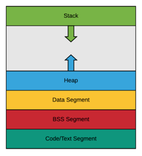

# 프로세스와 스레드

## 프로세스(Process)

* 메모리에 올라와 실행되고 있는 프로그램
* task와 같은 의미
* 하나의 스레드로 이루어진 싱글스레드 프로세스, 여러 개의 스레드로 이루어진 멀티스레드 프로세스로 나뉨

## 스레드(Thread)

* 프로세스 내 작업의 흐름

## 프로세스와 스레드의 차이

1. 메모리
    * 프로세스는 **코드, 데이터, 스택, 힙** 메모리 영역을 기반으로 작업하는 반면, 스레드는 프로세스 내의 **스택** 메모리를 제외한 다른 메모리 영역을 프로세스 내의 다른 스레드들과 공유하기 때문에 *
      *메모리적 이점**이 있음
2. 격리성
    * 프로세스는 다른 프로세스와 격리되어있기 때문에 서로 통신을 하기 위해서는 IPC를 사용해야 하지만, 스레드는 다른 스레드와 서로 격리되어있지 않으므로 그냥 통신할 수 있어 프로세스보다 빠름
3. 영향
    * 프로세스는 한 프로세스에 문제가 생겨도 다른 프로세스에 영향을 끼치지 않지만, 스레드는 격리가 되어있지 않아 한 스레드에 문제가 생기면 다른 스레드에도 영향을 끼쳐 스레드로 이루어져 있는 프로세스에 영향을
      줄 수 있음
4. 시간
    * 프로세스는 생성과 종료에 더 많은 시간이 들지만, 스레드는 더 적은 시간이 듬

# 프로그램의 컴파일 과정

1. 전처리
    * 소스코드의 주석 제거, #include 등 헤더 파일을 병합하고 매크로를 치환
2. 컴파일러
    * 오류 처리, 코드 최적화 작업을 하여 어셈블리어로 변환
3. 어셈블리어
    * 목적 코드(object code)로 변환
    * 이때 확장자는 운영체제마다 다른데 리눅스에서는 .o
4. 링커
    * 프로그램 내 있는 라이브러리 함수 등과 결합해 실행 파일이 만들어짐
    * .exe, .out 확장자를 갖게 됨

# 프로세스의 메모리 구조

* 스택
    * 지역변수, 매개변수, 함수가 저장되고 컴파일시 크기가 결정됨
    * 그러나 함수가 함수를 호출하는 등에 따라 런타임시에도 크기가 변경됨
    * 동적인 특징
* 힙
    * 동적 할당할 때 사용되며 런타임시 크기가 결정됨
    * 동적인 특징
* 데이터 영역
    * BSS 영역과 Data 영역으로 나뉨
    * 정적 할당에 관한 부분을 담당
    * 정적인 특징
* 코드 영역
    * 소스 코드가 들어감
    * 정적인 특징

## 정적 할당

* 컴파일 단계에서 메모리를 할당하는 것
* BSS segment 와 Data segment, Code / Text segment 로 나뉘어서 저장

### BSS segment

* 전역 변수, static, const로 선언되어있는 변수 중 **0으로 초기화** 또는 **초기화가 어떠한 값으로도 되어 있지 않은 변수**들이 이 메모리 영역에 할당됨

### Data segment

* 전역 변수, static, const로 선언되어있는 변수 중 **0이 아닌 값**으로 초기화된 변수가 이 메모리 영역에 할당됨

### Code / Text segment

* 프로그램의 코드

## 동적 할당

* 런타임 단계에서 메모리를 할당받는 것
* Stack 과 Heap으로 나뉨

### Stack

* 지역 변수, 매개 변수, 실행되는 함수에 의해 늘어나거나 줄어드는 메모리 영역
* 함수가 호출될 때마다 호출될 때의 환경 등 특정 정보가 stack에 계속해서 저장됨
* 참고로, 재귀함수가 호출된다고 했을 때 새로운 스택 프레임이 매번 사용되기 때문에 함수 내의 변수 집합이 해당 함수의 다른 인스턴스 변수를 방해하지 않음

### Heap

* 동적으로 할당되는 변수들을 담음
* malloc(), free() 함수를 통해 관리할 수 있음
* 동적으로 관리되는 자료구조의 경우 Heap 영역을 사용함
* 예를 들어, vector는 내부적으로 Heap 영역 사용

# PCB와 컨텍스트 스위칭

* PCB(Process Control Block)는 운영체제에서 관리하는 프로세스에 대한 메타데이터를 저장한 데이터블록
* 커널 스택에 저장되며 각 프로세스가 생성될 때마다 고유의 PCB가 생성이 되고 프로세스가 종료되면 PCB는 제거됨

## PCB의 구조

* 프로세스 상태 – 대기중, 실행 중 등 프로세스의 상태
* 프로세스 번호(PID) – 각 프로세스의 고유 식별 번호(프로세스 ID)
* 프로그램 카운터(PC) – 이 프로세스에 대해 실행될 다음 명령의 주소에 대한 포인터
* 레지스터 – 레지스터 관련 정보
* 메모리 제한 – 프로세스의 메모리 관련 정보
* 열린 파일 정보 - 프로세스를 위해 열린 파일 목록들

## 컨텍스트 스위칭

* PCB를 기반으로 프로ㅔㅅ스의 상태를 저장하고 다시 복원시키는 과정
* 프로세스가 종료되거나 인터럽트에 의해 발생됨

### 컨텍스트 스위칭의 비용

1. 유휴시간의 발생
    * 컨텍스트 스위칭을 할 때마다 프로세스당 유휴 시간이 발생
2. 캐시 미스
    * 프로세스가 가지고 있는 메모리 주소가 그대로 있으면 잘못된 주소 변환이 생기므로 캐시클리어 과정이 무조건 일어나게 되고 이때문에 캐시미스가 발생
3. 오버헤드
    * CPU는 중단된 작업의 상태(레지스터, 프로그램 카운터, 메모리 매핑 등)를 저장하고, 새 작업의 상태를 로드해야 함
    * 이때 일정한 오버헤드가 발생하게 되며 이 오버헤드가 자주 발생하면 전체적으로 시스템 성능이 저하될 수 있으며, CPU의 유효 가동 시간에 영향을 미칠 수 있음

### 스레드에서의 컨텍스트 스위칭

* 스레드는 스택 영역을 제외한 모든 메모리를 공유하기 때문에 비용이 더 적고 시간도 더 적게 든다는 장점이 있음