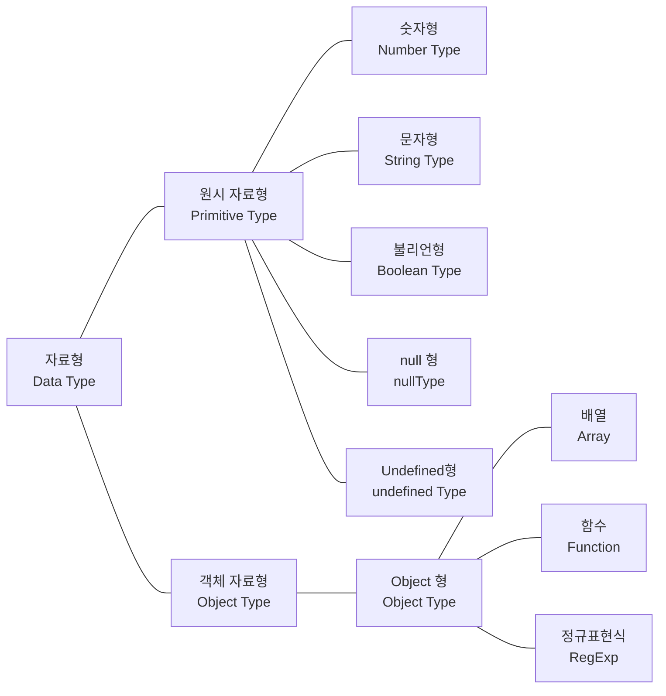

# 1. 변수와 상수

- `let` 으로 변수 선언시 변수를 중복 사용 불가
- `var` 은 중복 선언 가능
- `var`는 위의 이유로 인해 코드 복잡도를 높이기 때문에 가급적 `let`을 사용해야 함
- `const`로 선언
- 선언과 동시에 값을 할당

# 2. 자료형



- null
  - 대다수 프로그래밍 언어에서 null은 하나의 값으로 단순하게 취급하지만, 자바스크립트에서는 독립적인 자료형으로 분류
- undefined
  - 미정의 값
  - C나 자바 언어에서는 변수를 생성하고 아무런 값도 할당하지 않으면 null을 갖지만, 자바스크립트에서는 null 대신 undefined를 가짐

# 3. 형변환

## 숫자

- Number()
  - 숫자가 아닌 문자를 포함한 문자열은 NaN 반환(ex. "10개")
- parseInt()
  - 문자도 함께 포함된 문자열을 숫자로 변환하고 싶을때 사용
  - parseInt(변환하려는 문자열, 진수)

## 문자

- String()

## 불리언

- Boolean()

# 4. 연산자

## 같다

- `===`
  - 동등 비교 연산자
  - `==` 연산자는 값만 비교할 뿐, 자료형은 비교하지 않음

## null 병합 연산자

- `??`

```javascript
let varA = 10;
let varB = 20;
let varC;

console.log(varA ?? varB); ① // 10
console.log(varC ?? varB); ② // 20
```

# 5. 콜백 함수

## 콜백 함수가 필요한 이유

- 함수가 동일한 기능을 갖더라도 특정 부분이 달라 새 함수를 만들게 되면 중복 코드가 발생
- 콜백 함수를 사용하면 이러한 문제를 효과적으로 해결할 수 있음

```javascript
// 원래 코드: 동일한 부분이 많은 코드
function repeat(count) {
  for (let idx = 0; idx < count; idx++) {
    console.log(idx + 1);
  }
}

function repeatDouble(count) {
  // ①
  for (let idx = 0; idx < count; idx++) {
    console.log((idx + 1) * 2);
  }
}

repeatDouble(5); // 2 4 6 8 10
```

```javascript
// 개선 코드: 콜백함수를 사용
function repeat(count, callBack) {
  // ③
  for (let idx = 0; idx < count; idx++) {
    // ④
    callBack(idx + 1);
  }
}
function origin(count) {
  // ①
  console.log(count);
}

repeat(5, origin); // ②

// 출력 : 1 2 3 4 5
```

```javascript
// 개선 코드: 동작을 변경하고 싶다면 새 함수를 만들어 인수로 전달
function repeat(count, callBack) {
  // ③
  for (let idx = 0; idx < count; idx++) {
    callBack(idx + 1);
  }
}

function origin(count) {
  console.log(count);
}

function double(count) {
  // ①
  console.log(count * 2);
}

repeat(5, double);

// 출력 : 2 4 6 8 10
```

- 콜백 함수를 이용하면 상황에 맞게 하나의 함수가 여러 동작을 수행하도록 만들 수 있음

# 6. 객체

## in 연산자

- 객체에서 해당 프로퍼티의 존재 여부를 확인할 때는 주로 in 연산자를 이용

```javascript
let person = {
  age: 10,
};

let isNameExist = "name" in person;

console.log(isNameExist); // false
```
